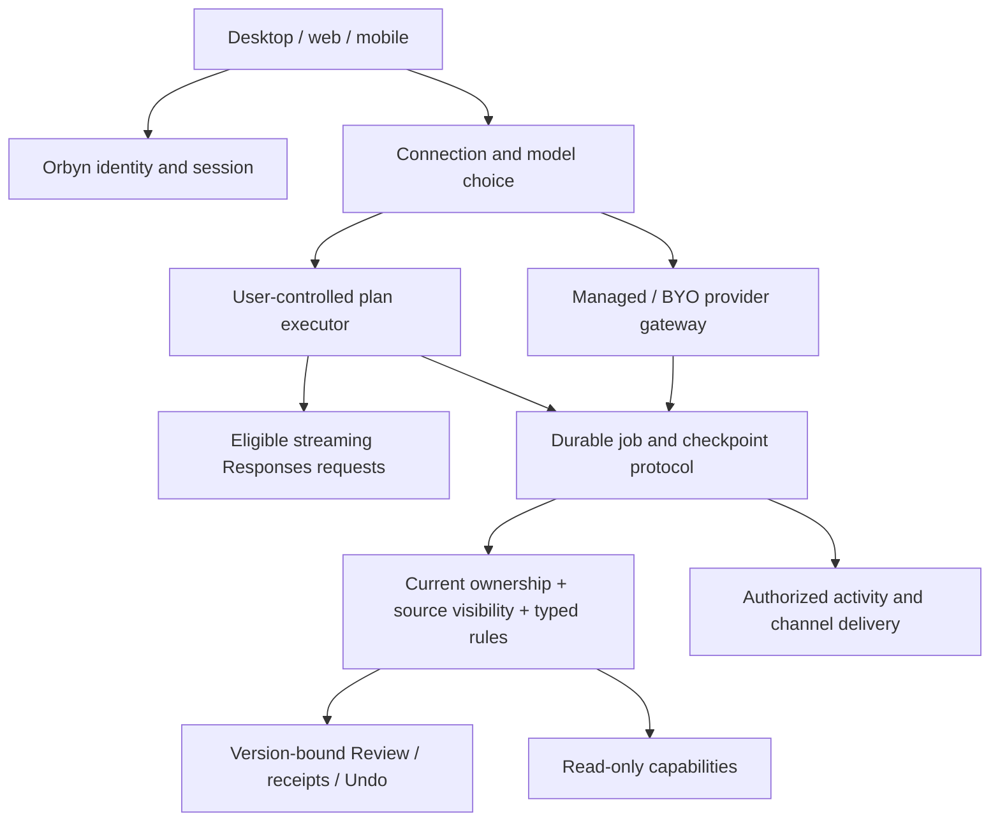

# DevDay 2026 → Orbyn: researched implementation proposal

**Status: revised implementation contract; user authorized tested production checkpoints.** Prepared 30 September 2026 against `main` at `b91ced2`. Worktree: `/Users/anhdang/.codex/worktrees/devday-2026-plan/Orbyn`; branch `codex/devday-2026-plan`. This document supersedes the implementation assumptions in `docs/openai-devday-2026.md`; the original is preserved beside it. Backend, desktop/web and mobile remain in scope.

## 1. What changed after research

| Original assumption                                              | Current evidence and consequence                                                                                                                                                                                                                                                                                                                                     |
| ---------------------------------------------------------------- | -------------------------------------------------------------------------------------------------------------------------------------------------------------------------------------------------------------------------------------------------------------------------------------------------------------------------------------------------------------------- |
| A1 treats ChatGPT identity and plan inference as one integration | They are distinct contracts. Website identity is a selected-partner trial; OSS plan usage has dynamic registration. Verify Orbyn's eligibility and deployment mode before promising website or mobile availability. [Quickstart](https://developers.openai.com/siwc/quickstart), [website](https://developers.openai.com/siwc/website).                              |
| Existing model adapter can be reused unchanged for plan usage    | Plan usage requires streaming Responses, `store:false`, a complete input array and restricted parameters/tools. Introduce a dedicated adapter and capability matrix. Existing server adapter returns a completed text response and is unsuitable unchanged. [Preview limitations](https://developers.openai.com/siwc/token-sharing-open-source/preview-limitations). |
| Model list is a generic normal API list with a curated fallback  | Documented plan catalog uses `models[]`, visibility, slug and display name. Refresh on account switch; never silently select an unentitled fallback. Preserve the user's model choice. [Models and inference](https://developers.openai.com/siwc/token-sharing-open-source/models-and-inference).                                                                    |
| Agent identity and rules are absent                              | Named assistant identity already lives in agent settings; standing rules already exist as text. New work is multi-agent ownership and deterministic enforcement, not a second unrelated identity system.                                                                                                                                                             |
| Document block tools are unlanded                                | That branch's work is already merged. Reuse current structured docs/comments and their revisions.                                                                                                                                                                                                                                                                    |
| Extensions have no docs, therefore A11 must wait                 | Public extension docs and SDK links exist. A11 can be scoped now, with host feature detection and a portable MCP fallback. [Extensions](https://developers.openai.com/plugins/build/extensions).                                                                                                                                                                     |
| Security CLI can simply run in CI                                | CLI availability does not imply scan entitlement: running scans needs Codex Security access. Keep CI secrets protected and patch publication human-approved. [Security access](https://developers.openai.com/blog/scaling-cyber-defenders-with-daybreak).                                                                                                            |
| Ultrafast is generically 6× priced                               | Do not carry this number into pricing UI. Sol documentation gives standard token rates and Fast at 2× standard; Fast and Ultrafast are distinct. Per-model/account availability must be checked. [Sol](https://developers.openai.com/api/docs/models/gpt-6.1-sol).                                                                                                   |

Dots, Space, Pro 500, Marketplace reach and Decisions preview details are not independently established by the developer pages fetched in this audit. Treat their product descriptions as inspiration, not an API contract or promised Orbyn dependency. No benchmark/price comparison is a measured Orbyn result.

## 2. Source and repository evidence

Official pages were opened, not merely search snippets. The source file's older checkout references are stale: R1–R10 and the Docker repair are now in main. This is source research and planning; no new product tests or provider calls were performed.

| Existing surface    | Inspected code                                                                                  | Reuse / remaining gap                                                                                                    |
| ------------------- | ----------------------------------------------------------------------------------------------- | ------------------------------------------------------------------------------------------------------------------------ |
| Provider adapters   | `backend/src/modules/ai/providers/adapters.ts`, `resolve.ts`                                    | Managed formats, Responses routing, timeout/error handling; add plan transport and explicit feature negotiation.         |
| Durable execution   | `backend/src/modules/ai/agent/run.ts`, `loop.ts`; `worker/night-shift.ts`                       | Leases, checkpoints, decisions and receipts; add device executor ownership without duplicating mutation engines.         |
| Identity and rules  | `modules/agent-context/routes.ts`; `packages/core/src/agent-inbox.ts`; `capabilities/policy.ts` | Named assistant and text rules already exist; typed rules and multiple agent records are new.                            |
| Activity / delivery | `modules/presence/live.ts`; `worker/delivery.ts`; `agent/notices.ts`                            | Existing announcements and durable notices; add resumable step events and external channel adapters.                     |
| Pages               | `modules/docs/comments.ts`, docs structure/services                                             | Human mentions and page authorization exist; scoped agent mentions/bound blocks require new behavior.                    |
| Distribution        | MCP catalog, `modules/mcp-server`, `modules/oauth`                                              | Existing OAuth server is not an SIWC identity client. Keep connector grants separate from OpenAI identity.               |
| CI                  | `.github/workflows/ci.yml`, `deploy.yml`                                                        | Tests, builds, mobile bundles and Docker checks exist. Security scanning/access and richer interactive QA are additions. |

## 3. Proposed architecture and invariants

**Credential boundary:** identity verification may create an Orbyn session. Plan access/refresh tokens stay in the authorized user-controlled runtime; server jobs hold an executor/connection reference, not those tokens. Device tool requests are untrusted instructions and must pass normal server capability authorization. A signed-in browser is not proof it may execute any job.

**Durability:** executor leases fence old devices; checkpoints and submission IDs survive reconnects; cancellation and approvals retain waiting identity checks. Refresh credentials atomically; switching account cannot reuse another account's model catalog or job. A fallback must use explicit consent and retain original provenance/billing visibility. No server-side account pooling.

**Permission composition:** effective access is the intersection of actor rights, workspace policy, agent scope, source visibility and rule restrictions. A page's grant list is an upper bound on eligible participants, not authority to impersonate another viewer. Never inherit the union of page viewers' permissions.

**Rules:** deterministic deny dominates approval, which dominates allow. Allow never overrides authentication, team policy, stale revisions, hard stops or source exclusion. Plain-language instructions remain guidance until converted into a reviewed typed rule. Rule edits invalidate applicable pending decisions and are rechecked before mutation.

## 4. Delivery ledger for the retained scope

Each row is part of the eventual scope. “Gate/spike” preserves the feature for review; it does not declare it delivered.

| ID / proposed priority    | Implementation deliverable and primary modules                                                                                                                                                                                                                                                                                                                           | Acceptance evidence required                                                                                                                                                                                                                                                                                   |
| ------------------------- | ------------------------------------------------------------------------------------------------------------------------------------------------------------------------------------------------------------------------------------------------------------------------------------------------------------------------------------------------------------------------ | -------------------------------------------------------------------------------------------------------------------------------------------------------------------------------------------------------------------------------------------------------------------------------------------------------------- |
| A1 / P0: SIWC             | Separate identity linking from plan credentials. Electron system-browser PKCE/state/nonce and validated ID token; secure OS storage; atomic refresh; first-option branding. Web partner flow and mobile callback/storage are separate eligibility spikes. Device executor, account model picker and dedicated SSE adapter in shared contracts + Electron/mobile modules. | State/nonce/replay/issuer/audience/account-link attacks rejected; no email-only account merge; actual eligible plan call; logout/revoke/account-switch tests; no tokens in server logs/DB; web and native callback proof. Unsupported deployment remains clearly unavailable, not a decorative sign-in button. |
| A2 / P0: managed AI       | Add connection-kind discriminator while keeping provider resolution, budgets, team/MCP flows and managed automations. Plan transport cannot leak into managed credentials or vice versa.                                                                                                                                                                                 | Existing provider suite passes; same managed conversation and automation behavior; explicit model/connection preserved; no silent paid fallback.                                                                                                                                                               |
| A3 / P0: Sol + caching    | Add catalog entry and capability validation; Responses tool path; supported reasoning values. Cache stable instruction/tool prefixes with documented controls, measure hits/write/input/output usage. Keep selected model rather than forcing a default.                                                                                                                 | Managed mock payload tests and real permitted probe; cost/latency quality evaluation against current baseline; unsupported settings fail clearly. API price is not an end-user plan bill.                                                                                                                      |
| A4 / P1: agent platform   | Typed per-action rules; adapt named assistant into multi-agent identity/owner/scope; link routines/goals, memory and channel settings; proactive read-only profile; persisted activity events; work/speed budgets; non-overridable hard stops; specialist agent ownership.                                                                                               | Every write path enforces rules; revocation during execution; impersonation/source leakage tests; job recovery with changed identity/scope; resumable activity; budget reservation races and accounting reconciliation; both clients render ownership/rules/activity.                                          |
| A5 / P2: maintained pages | Bind exact block IDs to agent + schedule; preserve human blocks; `@orbyn` comments create scoped jobs and replies; page UI creates routines; authorization intersection; mobile reading/sharing and editing remain planned.                                                                                                                                              | Concurrent human edit produces conflict, not overwrite; deleted/moved blocks invalidate bindings; revoked page access stops work/delivery; mention edit/delete/retry dedup; private comments never enter shared results; desktop and mobile flows exercised.                                                   |
| A6 / P2: Slack then Teams | OAuth installation, workspace/account mapping, opt-in DM delivery, durable outbox, signed callback validation, dedup, unsubscribe/revocation; replies map to exact waiting ID.                                                                                                                                                                                           | Provider mock contracts; verified signatures/replay/rate limits; real authorized test workspace delivery and stale reply rejection; titles rechecked for current visibility. Nothing sent without explicit connection consent.                                                                                 |
| A7 / P2: published pages  | Read-only publication record, explicit content selection, scoped revocable token, expiry and audit; distinguish pinned snapshot from live refresh. Reuse links/privacy modules.                                                                                                                                                                                          | Anonymous boundary tests; unpublished/private/source-excluded data absent; revocation immediate; updates don't silently broaden published scope; responsive viewer proof.                                                                                                                                      |
| A10 / P0 gate: security   | Confirm scan access, then scheduled CLI/SDK workflow with scoped secrets; threat models for OAuth, plan runtime, tools and publication; triage/dedup and reviewed patches.                                                                                                                                                                                               | Authorized scan artifact and controlled finding fixture; forks cannot read secrets; severity policy and human merge; report access unavailable accurately.                                                                                                                                                     |
| A11 / P2: plugin          | Build MCP Apps UI/extension resources, sidebar/composer/file-viewer entry points where supported; feature-detect hosts; preserve typed catalog and existing OAuth grants; partner SIWC outer/inner flows stay separate.                                                                                                                                                  | Local plugin connection, OAuth/account-switch, CSP/resource-origin and inaccessible-tool tests; supported ChatGPT/Codex surfaces proven; portable tool-only fallback. Submission approval is an external gate.                                                                                                 |

Prompt caching controls are documented for newer models, including implicit versus explicit breakpoint choices; apply only to supporting managed routes and never assume a field is supported on plan usage. [Caching](https://developers.openai.com/api/docs/guides/prompt-caching).

## 5. Execution order and review gates

1. **Contract foundation:** SIWC eligibility/deployment decision, threat model, shared connection/executor types, provider capability matrix and clean Docker dependency checks. Desktop local spike first; backend/web/mobile design stays in scope.
2. **Provider and rules:** A2 regression baseline, A3 model/caching evaluation, A4 typed policy/hard stops, A10 scan-access check. Auth “first option” becomes enabled only for platforms where the correct flow is available.
3. **Local plan runtime:** A1 credential flow and real inference, then executor fencing/reconnect/consent/fallback. Approval/mutations stay on Orbyn's existing authorized receipt path. Mobile rollout waits for native flow feasibility, not an invented loopback equivalent.
4. **Agent ownership:** A4 identities, routines/goals, scope, events and budgets; migrate existing named assistant without losing memory or schedules.
5. **Collaboration/distribution:** A5 bound pages/comments, A6 channels, A7 publication and A11 plugin. Deliver end-to-end permission and cross-client proof per feature.
6. **Docs and UI parity:** deliver the D1 Markdown contract and U1 cross-client regression matrix below. Voice, computer-use features/harnesses and the speculative Decisions adapter are removed from delivery scope.

No calendar estimate is committed: partner access, native callback constraints and external integrations are not established. Each stage needs backend focused regressions, full suite, core/API/client typechecks, clean backend/web images, migrations from empty and previous schema, iOS/Android exports, desktop/web and native mobile interaction proof. Existing 1,726-test results establish the prior baseline only.

## 6. Decisions for review

Preserve the source file's stated preferences: SIWC first when eligible, managed API available, user selects the model. The following are proposals requiring review:

- Launch plan runtime on personal desktop first; do not enable shared-team plan billing until ownership/terms are reviewed.
- Offline plan jobs defer by default; managed fallback requires explicit per-user authorization, clear billing and a recorded connection change.
- Multi-agent scope and typed rules precede assistant-maintained shared pages.
- Keep current MCP `get_profile` design; the obsolete Memory draft's profile relocation is not a prerequisite for SIWC.
- Web SIWC partner access and mobile flow feasibility are release gates. Continue existing sign-in while unavailable.
- Live published pages require explicit live consent, not an automatic widening of a snapshot link.
- Security scan entitlement, Slack/Teams credentials and real plan inference tests require authorized test accounts at implementation time.

## 7. Cleanup and stop boundary

All old refs are recoverable in `.codex-cleanup-backups/2026-09-30/all-refs-before-final-cleanup.bundle` in the primary checkout. Local worktree configuration and untracked Gradle files were preserved before old worktree removal. The original branch review is retained as historical evidence.

Remote cleanup status: automatic approval review rejected deletion of all 49 non-main GitHub branches; exact-scope confirmation is pending. The new planning branch is local only.

**Implementation proceeds in checkpoints after this revision.** Each merge requires the acceptance evidence below. Architecture documentation does not constitute delivered product behavior.

## 8. Revised scope and added contracts

The user removed voice and computer use. A8, A9 and speculative A12 are not implementation deliverables. Their historical research in the original source file is superseded by this contract. Security scanning remains an access-gated engineering control, not an autonomous app-control feature.

### P1 — Separate plugin backend integration

Add a plugin integration module and explicit service boundary alongside the existing MCP process. Plugin resource/UI/event handlers use the same typed capabilities but an independently authenticated connector principal; they do not call the browser's assistant session or impersonate first-party routes. Host-provided metadata is untrusted. Plugin backend provider calls use authorized managed/BYO connections only. User-controlled plan tokens never enter this integration. Apply trust, scopes, revisions and durable receipts before writes. Share domain services rather than duplicating tool mutations. Define explicit schemas for launch context, UI resource reads, tool calls, asynchronous job/result events and reconnect cursors. Retain the existing portable MCP surface. Test separate issuer/resource/audience and account-switch behavior, inaccessible tools, rate limiting, duplicate callbacks and tenant isolation.

### M1 — Account model catalog and defaults

Expose a first-party `/models` experience for ChatGPT-connected users. The credential-owning runtime fetches `GET https://api.openai.com/v1/models` with that account's token, normalizes `models[]` using list visibility, slug and display name, and preserves upstream ordering. Backend GET `/models` requires an Orbyn session and returns only sanitized catalog metadata for the selected user-owned connection/executor; it never proxies arbitrary URLs or accepts a plan token. A device publishes an account-bound catalog snapshot through its authenticated executor channel. A missing/offline/expired snapshot is explicitly unavailable/stale, not a managed catalog mislabeled as ChatGPT. Persist default model by user + connection + ChatGPT account/workspace. Changing the account refreshes its catalog and restores that account's default. An unavailable saved model is shown as unavailable and requires a new choice; never silently replace it. Inference rechecks current model availability in the credential-owning runtime. Plugin calls cannot access this first-party preference API. Settings and composer share one selected/default state; model and connection switch cancel old loads. Tests include cross-user snapshots, invalid defaults, stale/offline catalog, account switching, revocation, reconnect and concurrent preference edits. [Official catalog contract](https://developers.openai.com/siwc/token-sharing-open-source/models-and-inference).

### D1 — Markdown visualization parity

Use the VS Code built-in Markdown experience as a concrete baseline, with documented extensions rather than unlimited third-party extension execution. Keep Orbyn's structured blocks and canonical Markdown representation.

| Capability     | Required behavior and verification                                                                                                                                                                                                                                              |
| -------------- | ------------------------------------------------------------------------------------------------------------------------------------------------------------------------------------------------------------------------------------------------------------------------------- |
| CommonMark/GFM | Headings and anchors, paragraphs, hard/soft breaks, emphasis/strike, quotes, nested ordered/unordered/task lists, rules, escaped text, tables, links and images; import/edit/export round-trip fixtures, including embedded fences.                                             |
| Code           | Language-aware bundled syntax coloring, copy/source view, long-line scrolling contained within block, accessible fallback for unknown languages; no execution.                                                                                                                  |
| Mermaid        | Desktop and mobile flowchart, sequence, state, class, ER, gantt, pie, journey, mindmap and timeline fixtures; strict configuration, diagrams cannot override security or execute links/scripts; useful parse error + editable source; zoom/scroll/export without page overflow. |
| Math           | Inline/display LaTeX rendering, accessible source, consistent preview and export; malformed expressions do not break the page.                                                                                                                                                  |
| Extended text  | Existing callouts, highlights and footnotes; reference links, YAML frontmatter preservation and TOC/heading navigation. Raw HTML never executes; unsupported syntax is retained as source rather than discarded.                                                                |
| Preview        | Source and rendered view, desktop side-by-side with block/line mapping and scroll synchronization; mobile toggle in the same document; revisions/save status shared rather than competing drafts.                                                                               |
| Export/share   | Markdown source preserved; rendered HTML/PDF contain diagrams/math when supported; snapshot/publication respects authorization and current sources; no private resource links disclosed.                                                                                        |
| Media/security | Current file-store authorization, alt text and safe URL protocols; no remote scripts, iframe execution or diagram-driven external calls; malformed/huge diagrams bounded.                                                                                                       |

Existing desktop Mermaid and rich blocks are reused. Mobile's current flowchart-only renderer is insufficient for D1. Choose a bundled isolated rendering surface or authorized generated SVG with sanitized bounded output; validate Expo/native support before selecting the implementation. No renderer choice may turn private diagrams into publicly accessible assets. [VS Code baseline](https://code.visualstudio.com/docs/languages/markdown), [Mermaid security](https://mermaid.js.org/config/schema-docs/config-properties-securitylevel.html).

### U1 — UI synchronization and regression gate

#### Web redesign and settings acceptance — user scope addition, 1 October 2026

Complete the existing ADR before declaring the release ready. The user authorizes a
full web redesign and requires a full settings UI/UX redesign. Preserve the existing
palette and typefaces; mobile's current visual design is retained. Mobile still
receives the connection, model and provider functionality required for parity.

The web audit covers the application shell, navigation, Home, Agenda, tasks,
calendar, projects, Docs, memory, agent notes, views, study, lists, assistant,
Overnight, teams, booking, notifications, review, settings and admin. Record each
surface's layout defects and delivery evidence. Correct hierarchy, density,
alignment, containment, loading/error/empty states and keyboard navigation;
shared components must be checked across their consumers. A settings-only change
does not satisfy the full web scope.

Settings must provide a clear navigation structure, searchable controls, readable
labels and descriptions, account/security management and an identifiable AI &
models destination. Separate personal connections and model defaults from
workspace-managed providers. ChatGPT must have a discoverable connection entry,
account/workspace selection, connection health, device availability, reconnect and
disconnect actions, and the actual account catalog/default selector. An MCP grant
to an outside ChatGPT agent is a different connection and must not be presented
as ChatGPT plan access. Show eligibility or platform constraints accurately;
never make an enabled connection button depend on an absent runtime.

Provider administration must support multiple saved connections, including
multiple connections of the same kind and custom compatible endpoints. Inventory
the existing twenty provider definitions before adding integrations. Validate each
adapter's actual supported request format and capabilities. Support independently
selected text-generation and text-embedding providers/models, credential testing,
catalog refresh and explicit manual model entry where discovery is unavailable.
Embedding settings must report capability, dimensions and indexing status;
changing embedding models must handle incompatible existing vectors safely.
The [embedding provider audit](embedding-provider-audit-2026-10-01.md) defines
the required mixed-version rollout, provider-bound consent, dimension validation,
document/configuration revision fences, conditional queue acknowledgement and
upgrade/race acceptance matrix. Its adapter checkpoints do not complete these
configuration and reindex requirements.
Do not assume every text provider supports embeddings or that a model catalog
implies ChatGPT plan entitlement. Persist selection and verify refresh, account
switch, revocation and unavailable-provider behavior in both clients.

Acceptance requires functioning backend/client wiring, focused regressions,
workspace typechecks/build and full tests, plus actual responsive web interaction
checks in both themes. Test long labels, large catalogs, search, validation,
keyboard focus, slow/offline loading and nested menus/modals. Record mobile
functional parity and native verification separately. Commit and integrate ready
checkpoints to main; do not report a visual mock or private helper as delivered.

Audit all affected current surfaces: Assistant/Overnight/reminder cards, Docs/editor/comment layers, settings/auth/model picker, navigation/deep links, plugin UI and public viewers. Test narrow phones, tablet widths and wide desktop, both themes, keyboard open/closed, large text, long labels/code/tables/diagrams, empty/error/loading states and overlay nesting. Menus/modals must remain within the viewport and have one focus owner. Restore/send/poll generations, live events, dirty editor saves, model switching and stale approvals must not overwrite newer state. Cover native iOS and Android interactions separately from mobile web. Typechecks/exports alone do not prove touch or visual behavior. Keep visual proof and feature-by-feature acceptance status in the ledger. Do not claim all prior UI defects are fixed without inspecting and reproducing their affected surfaces.

### Checkpoint policy

C0: this ADR/artifact revision (documentation only). C1: model/provider/connection contracts. C2: SIWC/catalog/defaults and device execution. C3: typed rules/agent ownership/activity/budgets. C4: Docs parity and UI regressions. C5: bound pages/publication/channels. C6: separate plugin backend/UI and access-gated security controls. Dependencies can change order, but every retained ledger row must finish. Each production checkpoint receives a scoped commit, main integration, current test/build/runtime evidence and explicit external-access limitations. Preserve user changes in the primary checkout.

### C1a foundation checkpoint — 2026-09-30

Implemented shared account-bound ChatGPT catalog parsing, explicit unavailable defaults,
and a separate device-side text Responses transport with fixed provider endpoints,
request allowlists, stream completion validation and bounded responses. This is the
contract/transport foundation: OAuth, secure token storage, persisted preferences,
backend identity verification, tool execution and `/models` UI remain open under C1/C2.
No real account inference or provider credentials were used for this checkpoint.

Follow-up contract review (1 October, local main checkpoint `1c44b40`): the plan transport now binds
credentials to the issued OAuth client ID as well as the account/workspace.
It rejects `dynamic_agent_client` as a saved registration and refuses a different
registration before making a provider request. All 17 transport tests passed;
these use fixtures, not a real OAuth or inference session. Identity verification,
protected token storage, model/default persistence and `/models` UI remain open.

Model-picker state foundation (local main checkpoint `1c44b40`): shared validated binding/preferences
and a credential-free controller now coordinate catalog/default loading for one
verified user, connection, issuer, subject and issued client ID. Settings and
composer can subscribe to one state. Versioned storage receipts are checked;
concurrent saves are rejected, failed loads disable stale choices, removed
defaults remain unavailable, and closing a connection fences late loads/saves.
Eight focused controller tests passed. Backend authenticated persistence/CAS,
OAuth verification, runtime storage, actual `/models` routing and both client
UIs remain open. No provider tokens or real account requests were used.

The contract checkpoint and cleanup-test checkpoint `2d35df6` were applied to
local main; all main workspace typechecks and 38 focused tests passed. The full
main suite passed all 1,778 tests with no failures or skips. The Mermaid implementation is still
outside main. None of these local commits establishes a production deployment.
Both checkpoints were pushed to origin main at `2d35df6`; the main production
build passed. Production rollout remains unverified.

Backend identity-verifier foundation: signature verification uses the
fixed OpenAI JWKS endpoint, issuer, issued-client audience, nonce, required
claims, a five-second clock tolerance and a ten-minute token age limit. Multiple
audiences require a matching authorized party. It returns only issuer/subject/
client ID and exposes generic errors rather than token/provider details. Four
tests using real RSA signatures cover valid identity and claim/signature/input
failures; backend typecheck passed. No real account or credential was used.
The worktree now also has ten-minute, exact-session challenges, atomic nonce
consumption and registration linking, owner-only listing/disconnect, challenge
invalidation on disconnect, and account/session rechecks after verification.
First-party `/ai/connections/chatgpt` endpoints reject API keys and connector
credentials; shared schemas/client methods reject plan tokens. Provider proof is
never stored, logs redact token fields, expired challenges have an hourly sweep
rule, and shipped Privacy text explains retained identity metadata. Connection
operations bypass the 24-hour idempotency cache, so expired/revoked sessions cannot
replay a cached connection result. OAuth callback/PKCE/device storage, provider
eligibility proof, actual eligible plan usage, executor integration and
authenticated `/models` remain open. This foundation is not a completed sign-in
flow. Focused route, identity, lifecycle, cleanup and capability-inventory tests
passed 26 checks; a subsequent regression run passed 35 checks, including the
final account-restriction race test and legal publication. The first broad run
failed three checks: the existing intermittent assistant sweeper assertion,
legal publication with a shipped date ahead of the server's UTC date, and stale
generated route counts. Legal versions now advance even when the clock moves
back; generated catalogs were refreshed. The sweeper's failure did not reproduce
in the focused rerun, so its cause remains unproven.

A new, independently marked disposable database applied the migrations and
passed the complete 1,805-test worktree suite with no failures or skips. All
workspace typechecks and the production build passed on the final source.
The connection checkpoint is committed as `c7824fb` in the implementation
worktree and integrated into main as `ed379a1`. That exact main checkout passed
all 1,796 tests with no failures or skips, all workspace typechecks and the
production build. The checkpoint and its evidence were pushed to origin main
at `a31071b`.
Production rollout is not verified; the preceding GitHub CI could not start
because of account billing/spending limits, and Deploy was skipped.
Mermaid implementation files were excluded from that
checkpoint and remain unmerged pending actual rendering/native verification.

Evidence: 16 focused tests passed; full backend suite 1,742 passed with no failures or
skips; all workspace typechecks and production builds passed; iOS/Android exports
passed; a fresh backend Docker build successfully imported both shared exports.
No UI behavior changed in this slice.

Release priority update: after C1a integration, investigate refresh-triggered HTTP 429
and audit missing desktop/web/mobile feature parity. Deliver tested fixes and main
checkpoints before resuming the remaining DevDay implementation sequence. Preserve
all retained ADR scope; record any external or native verification limits explicitly.

### D1 implementation progress — 2026-10-01 (unmerged)

The mobile flowchart-only preview has been replaced in the implementation worktree
by a full, locally bundled Mermaid 11.17.2 renderer. Native uses Expo-compatible
WebView 13.16.1; mobile web uses an opaque sandboxed iframe. Both receive bounded
source and theme messages, reject stale results, retain source on failures, and
offer zoom and SVG export. Configuration directives are rejected; the renderer
uses strict policy, blocks network resources through CSP, and removes executable
or external references from exported SVG. Existing authorized Orbyn node links
remain host actions. Generated renderer assets have a reproducible build command.

Evidence so far: nine source/protocol/security tests, ten neatness tests, all workspace
typechecks, and web/iOS/Android exports passed. Ten diagram-family fixtures are
prepared, but actual rendering and native layout/touch/export remain unverified.
Browser access to the local acceptance page was explicitly declined, so that
verification path was stopped. This change is not merged or production-ready.
Desktop renderer synchronization and the rest of the D1 acceptance table remain
open; source checks and bundle exports are not evidence of visual parity.

The protocol tests execute the actual message handler with a controlled Mermaid
engine and DOM boundary; they prove message fencing, strict pinned configuration,
size/directive/theme rejection, and rejection of escaped external CSS, imports
and image functions. SVG animation elements are excluded from export. A source
digest check rejects a stale generated renderer asset. The native surface keeps
its HTML source object stable to avoid reloads when rendered height changes.
These tests do not execute real layout or prove the ten-family render matrix.

The latest full suite completed with 1,776 passes and one sweeper fixture failure.
The fixture now asserts a completed sweep (with a bounded retry when the cleanup
lease is occupied) and checks the assistant-job rule's error result. A separate
test proves an occupied lease returns null. All 13 assistant-worker tests passed
in the focused rerun. A fresh complete suite is required before integration;
the occupied-lease test does not establish the cause of the earlier failure.

The complete rerun subsequently passed all 1,779 tests with no failures or skips.
The newly added model-picker file was outside that run's initial file list; its
eight tests passed separately. All workspace typechecks passed. Visual/native
renderer checks and the remaining application integrations are still open.

### C2 desktop OAuth/storage progress — 2026-10-01 (unmerged)

Private main-process helpers now implement bounded loopback OAuth callbacks,
fresh state/nonce/S256 PKCE, issued-registration validation, fixed-endpoint code
exchange and an encrypted account/server-bound credential vault. Callback scopes
cannot enable plan usage; token-response scopes are authoritative. Storage uses
atomic encrypted replacements, version checks and immediate disconnect fencing.
Reads use one descriptor, reject symlinks and bound allocation/read size even
when the path or file changes. These helpers are not wired into IPC or packaged
into the released app and do not constitute a usable sign-in flow.

Twenty focused OAuth/vault regressions passed, including a signed fixture ID
token through callback/exchange/verification/storage. Actual Electron 44.3 on
macOS encrypted synthetic credentials, restored them in a separate fresh process
and erased them. No real provider credentials or account calls were used. This
development executable proof does not cover signed releases, updates, native UI,
Windows or Linux. The prior combined regression set passed 48 tests and all
workspace typechecks; the added descriptor regression passed subsequently.

Registration metadata now has a private, account/server-bound store with a stable
host ID, atomic issued-client retention and optimistic revision checks. Four tests
prove restart persistence, an expired-code retry retaining its registration,
account/server isolation, corrupt/symlink rejection and concurrent-write fencing.
All 24 OAuth/registration/vault regressions passed. Metadata contains no codes or
tokens. Callers must use one main-process store per account/server and retain the
issued ID before exchange; orchestration is not wired yet.

Private sign-in orchestration now retains callback registration before exchange,
uses the exact server challenge nonce for local verification, compares local and
server identity metadata, and installs credentials only after both agree.
Cancellation fences every awaited phase and revokes a newly installing slot;
an already installed slot requires disconnect before replacement so cancellation
cannot erase older credentials. Five controlled orchestration tests cover ordering,
identity/account/backend mismatches, phase cancellation and replacement protection.
Concurrent attempts for one account/vault are rejected before any asynchronous
work. The attempt lock remains held after cancellation until pending adapters
have stopped, preventing a cancelled loser from revoking a later winner. A
controlled non-cooperative adapter regression proves both lock retention and
release after termination. The combined desktop-helper regression set passed
30 tests. Trusted adapters are
injected; production IPC, local verifier packaging and real-provider flow are absent.
Seamless reauthentication of existing credentials remains a separate open protocol.

Still required: trusted
main/preload entrypoints, account/session cancellation, local signature verification,
refresh rotation, real eligible provider proof, executor enrollment, catalog/default
persistence, `/models` and client integration. Repository metadata is private with
no recognized license; eligibility for the documented OSS flow remains unproven.
Do not infer website or mobile entitlement from the desktop helper.

GitHub's code-scanning API returned 403 because Advanced Security is disabled.
This is not evidence of Codex Security access or a completed security scan. Main
CI run `36769753341` could not start due to account billing/spending limits and
Deploy was skipped. Those external gates do not prevent continuing local work.

The complete worktree suite subsequently passed 1,835 tests with no failures or
skips, covering the thirty desktop-helper tests and the unmerged Mermaid checks.
Identity verification has now moved unchanged into the explicit
`@orbyn/api-client/openai-identity` entrypoint with its declared `jose` dependency;
backend reexports it and desktop orchestration uses it by default. The ordinary
client entrypoint does not import it. Added RSA/EC/shared-entrypoint regressions
and renderer digest checks passed in a forty-test focused run; all workspace
typechecks passed. No real OpenAI session or inference request was used.

The shared-verifier checkpoint `83a9074` is integrated into local main as
`6be8a81`. Exact-main typechecks, production build and all 1,798 tests passed
with no failures or skips, and the checkpoint was pushed to origin main.
Production deployment remains unverified. The private OAuth/store/orchestration files
and Mermaid implementation remain excluded from this checkpoint.

The private desktop IPC guard now binds credential operations to the designated
main window, its top-level frame and the exact local entry file, checking both
the invoking frame and the owning page's current URL. Destroyed windows, child
frames, sibling windows, remote/network-file URLs and navigated pages are denied
with generic errors. Three controlled guard tests and the combined 33-test
desktop-helper set passed. A separate Electron 44.3 macOS fixture invoked actual
IPC from two sandboxed/context-isolated windows: the designated main window was
allowed and the sibling was denied. This is fixture evidence, not a packaged
release or complete authentication UI check. The guard is not wired into app
handlers yet. The completed main validation is recorded above.

The private OAuth transport now supports the documented refresh grant at the
fixed token endpoint, using the saved issued client ID, refresh token and API
resource without sending a new scope. Omitted replacement refresh/ID tokens and
scope retain their saved values; explicitly reduced scopes remove plan permission.
Invalid grants have a distinct generic recovery error, malformed replacements
are rejected, and cancellation fences late responses. Five controlled refresh
tests and the combined 38-test desktop-helper set passed. This is transport only:
per-registration refresh serialization, replacement identity verification,
atomic vault rotation, session recovery and real-provider proof remain open.
The registration store now supports distinct validated registration slots under
one Orbyn account/server, preserving the existing primary slot's path and legacy
metadata. Issued clients remain separate across slots and copied records fail
the slot-binding check. Five registration tests and the combined 39-test desktop
helper set passed. Persisted slot listing/selection and
the actual account picker still remain open; this storage change is not UI proof.
[Refresh contract](https://developers.openai.com/siwc/token-sharing-open-source/profiles-and-sessions).

Shared host identity is now implemented for new registrations: one private
installation file is atomically published without replacing an existing ID.
Four separate Node processes converged on the same host ID; concurrent readers,
permissions and corrupt/symlink rejection also passed. Existing registration
records retain their original host IDs for returning sign-in compatibility.
All 42 desktop-helper tests and workspace typechecks passed. Listing/selection, picker UI, refresh
orchestration and production entrypoint wiring remain open and unmerged.

After pushing `6be8a81`, CI run `36793519501` could not start because of the
same GitHub account billing/spending limit; Deploy `36793529950` was skipped.
This confirms the external release gate persists, not a production rollout.

Registration listing is now available privately for the account picker adapter.
It scans at most 1,000 registration files, validates bounded file contents and
slot/filename binding, filters by current Orbyn owner/server, and returns only
slot ID, host ID, issued client ID, revision and an optional verified connection
binding. The vault is never read. Listing
does not create a registration; malformed or copied matching records fail with
a generic error. Tests cover empty listing, multiple slots, another owner and
copied-slot rejection. Persisted active selection, verified account labels,
production IPC wiring and actual picker behavior remain open.

Registration slots now retain the verified Orbyn connection binding after local
signed identity and backend identity agreement, before credential installation.
Owner/client mismatches, stale revisions and replacement with another identity
are rejected. The metadata read/list path does not decrypt credentials; an
identity record does not imply usable plan credentials. Seven registration tests
cover restart persistence, identity substitution and concurrent writes across
separate store instances. A shared per-file main-process queue serializes these
writes; multi-process metadata mutation is not supported. The native app's
single-runtime ownership must remain enforced at integration. Active selection,
account labels, UI wiring and refresh orchestration remain open.

Vault reads now perform a symlink/regular-file check before opening and compare
the opened descriptor's device/inode identity, supplementing `O_NOFOLLOW` on
platforms where that flag is absent. A regression replaces the path during an
asynchronous keychain availability check: the current read stays on its already
opened validated file, and a subsequent read rejects the tampered replacement.
All ten vault tests passed. These filesystem tests ran on macOS; they do not
establish native Windows/Linux storage behavior or complete the platform gate.

Active registration selection now persists per Orbyn owner/server with an opaque
revision. Selecting an unverified/missing slot fails, concurrent selections with
the same revision have one winner, stale changes fail, and clearing selection is
explicit. The shared main-process metadata queue now covers all slots for one
owner/server so separate store instances cannot race selection. Eight registration
tests cover persistence, competing choices and owner isolation. This is selection
metadata only: it does not prove credentials, entitlement or a server session are
live. Runtime account-switch cancellation, offline/revoked UI states and the native
account picker remain open, as do refresh orchestration and `/models` integration.

The private active-connection resolver distinguishes unselected, selected metadata
and unavailable saved registrations. It retains a missing registration's saved
ID/revision and never substitutes another slot. The expanded selection regression
checks resolved identity metadata, explicit clearing and a deleted selected slot
while another valid slot remains. The initial expanded test placed its stale-write
assertion after deleting that slot and received the expected missing-slot rejection;
the assertion was moved before deletion so both independent behaviors are tested.
Runtime credential/server availability checks and actual UI remain unimplemented.

The private registration store now persists a local model-preference cache bound
to its verified user/connection/issuer/subject/client identity. Concurrent writes
use an optimistic integer version; stale saves and different bindings fail, and
clearing is explicit. Preferences survive restart and a separate registration
starts unselected. Nine registration tests passed. This is local cache storage,
not completion of M1: authenticated backend persistence/CAS and synchronization,
fresh catalog entitlement validation, `/models` routing and both client UIs remain
open. A trusted catalog/controller adapter must validate the selected model before
calling this private cache writer; it must not be exposed as arbitrary IPC input.

A private desktop model-runtime adapter now connects the shared picker, bound
encrypted vault, live catalog transport and local preference cache. It checks
the selected registration/revision and a trusted live Orbyn connection callback,
rejects expired or non-sharing credentials, reloads the catalog before saving a
non-null default, and cancels catalog requests when closed. The issued client ID
is used only as the transport's registration/workspace consistency anchor, not
as a separately discovered workspace identifier. Three controlled adapter tests
cover live loading/default saves, removed models, changed selection, revoked
connections and expired credentials. No real OpenAI request was used. Backend
catalog/preference synchronization, IPC, model UI and full account-switch/save
race verification remain open. This adapter remains unmerged.

Runtime model saves now pass the captured selection revision and lifetime abort
signal into the local store. The owner/server queue checks the selected slot and
revision before mutation, and cancellation is checked before atomic publication.
Regressions prove a pre-cancelled save and a save queued behind an account switch
leave the prior preference intact. A controlled transport test also proves closing
the runtime aborts an in-flight catalog and prevents late picker publication.
This does not establish backend synchronization or the UI/platform switch matrix.

An integration regression now runs the actual shared picker/runtime adapter with
the real on-disk registration store. Switching selection while a default-save
catalog request is pending rejects the save and leaves the preference unselected
at version zero. A fresh runtime after reselecting the account saves the choice,
which a restarted store restores at version one. Provider and vault callbacks are
controlled fixtures; this proves local controller/storage composition, not a real
provider session, OS encryption, backend persistence or user-facing interaction.

Backend preference persistence has started with migration 200: one credential-free
model/version row per verified connection, safe-integer version bounds, model
syntax bounds and cascade deletion. The private read service rechecks the exact
live Orbyn session/account and connection ownership/revocation under transactional
locks, returns an explicitly unselected version-zero preference when absent, and
derives the response binding from server identity metadata. Twelve connection
tests passed on the marked disposable database, including two added preference
cases covering owner isolation, revoked connections, disabled/expired sessions,
database constraints and cascade cleanup. No HTTP preference route or write API
is exposed yet; executor catalog validation, optimistic writes, synchronization
and `/models` UI remain open. This migration/service slice remains unmerged.

The private backend preference writer now requires a trusted catalog-validation
callback, checks exact identity binding, and serializes compare-version writes
through the connection row. Session/account/connection state is rechecked after
the callback; revocation during validation prevents mutation. Concurrent writes
from the same version have one winner, clearing is explicit, and returning OAuth
to the same registration restores its persisted model/version. Fourteen connection
tests passed on the marked disposable database. This callback is not exposed as
HTTP input: the authenticated executor/catalog adapter and public preference API
remain unimplemented. These tests use controlled validators, not live entitlement.

Stale backend preference versions now fail before invoking catalog validation,
while the transactional version check still handles concurrent changes afterward.
An added regression disables the account, removes email verification or expires
the exact session during the validator callback; each pending write is rejected
and leaves no preference row. This extends the service-level race gate and does
not prove the still-unimplemented HTTP/executor integration.

Executor wire contracts have started in shared core: public Ed25519 SPKI
enrollment input, an exact-registration challenge, signature completion and
bounded catalog metadata with lease epoch and publication sequence. Strict
schemas reject provider tokens, arbitrary endpoints, duplicate models and extra
model fields. Two tests passed using real generated public keys/signatures and
invalid catalog fixtures. These schemas validate syntax only: server-side key/
signature validation, exact-session challenge consumption, replay/lease fencing,
authenticated publication and all runtime/platform adapters remain open. The
ongoing full-suite run started before these two tests existed; it cannot be used
as their execution evidence. Their focused run is recorded separately.

### Executor proof and preference checkpoint validation

The private executor verifier now validates canonical Ed25519 SPKI bytes and
signatures against the saved server challenge message. Three proof tests reject
changed messages, foreign keys, private keys, a same-size X25519 public key and
noncanonical public-key/signature encodings. Together with the two contract tests,
all five focused tests passed; all workspace typechecks passed afterward. This
does not establish enrollment authorization, challenge consumption or leases.

The previously running worktree validation completed with 1,864 tests passed,
zero failures/skips, and a successful production build. Its initial test list
excluded the five executor tests added afterward. The credential-free backend
preference migration/service and 15 connection tests were committed separately
as `d0f8ae6`, then integrated into local main as `4c5c909`. Exact-main typecheck,
build and full-suite validation is running before push. No preference HTTP route
is exposed: authenticated executor/catalog validation and the user-facing models
flow remain required. Other unmerged helpers and Mermaid work are outside this
checkpoint.

Private executor enrollment now persists five-minute exact-session challenges
with canonical public keys, server-generated proof messages and one-time atomic
consumption. Connection ownership and account/session state are rechecked under
parent-first locks. Enrollment renewals compare both epoch and registration ID,
so competing renewals or a deleted/recreated registration cannot accept an older
proof. Disconnect consumes pending device challenges and removes enrolled keys;
returning OAuth does not revive those proofs. Pending proofs are capped at five
per owner and registrations at twenty per connection, including completion-time
checks. The sweeper removes expired proofs and keeps live ones.

All 21 connection/enrollment tests passed on the independently marked
`orbyn_executor_enrollment_20261001_test` database. Four sweeper tests passed after
correcting a parameter-count error in the new test fixture. Workspace typechecks
passed for the service. Migration 201 and enrollment remain unmerged while their
full worktree validation runs. No enrollment HTTP routes, executor leases,
authenticated catalog publication or runtime enrollment adapters exist yet;
enrollment alone authorizes no provider call.

Catalog proof preparation now canonicalizes strict shared metadata, hashes it
with SHA-256 and verifies an Ed25519 signature in a separate catalog domain.
Seven focused contract/proof tests passed, including a thousand-model catalog,
property-order normalization, model-order tampering and changes to the account,
executor, lease or publication sequence. All workspace typechecks passed.
Neither a valid signature nor an enrolled key proves provider entitlement; lease
authorization and live catalog publication are still required.

The enrollment full run ended with 1,820 passes and four failures. One was the
existing assistant-worker retention assertion: both stale fixture jobs remained.
The same assertion failed in exact-main validation, then all 13 focused worker
tests passed without a source change. Its cause remains unverified; a complete
exact-main rerun is active before any push. The other three enrollment-run
failures were missing shared exports while new catalog helper source was edited
and package outputs rebuilt during that run. That run cannot establish the
current source state. Future full validation must use stable source/package
outputs without overlapping edits or rebuilds. The retention assertion now
records the actual sweep count and remaining-row eligibility to diagnose a
recurrence without weakening its expected deletions. Enrollment remains unmerged.

The exact-main rerun completed with all 1,803 tests passed, zero failures/skips.
Together with the successful exact-main typecheck/build, this validates the
private preference checkpoint `4c5c909`, now pushed to `origin/main`. The earlier
retention failure and its unverified cause remain recorded above; the rerun is
not evidence of a retention fix. Production deployment of this checkpoint is
unverified. Enrollment/catalog proof work is starting a fresh stable-source full
validation before integration.

### Validation follow-up and D1 dependency audit — 1 October 2026

The current enrollment/expiry full-suite run has reported a failed MCP matrix
assertion: two settings queries escaped the read-only transaction client.
The suite remains running; this is a failed gate, not a passing checkpoint.
Source inspection locates `cachedSettings()` in the context read capability.
When the ten-second settings cache expires, that accessor starts `settings()`
through the primary pool from inside the capability transaction. The two SQL
statements reported by the guard match the settings loader and legacy-key
expiry lookup. Reproduce with an explicitly invalidated settings cache before
choosing a correction; preserve the pool/network guard and cover expired-cache
behavior rather than accepting these reads as exceptions.

D1 is still incomplete. The shared document type and request schema accept only
heading levels 1–3, and Markdown parsing only recognizes those levels. Rich HTML
paste also clamps headings to 3. Extending the parser alone is insufficient:
update document schemas, outline and heading-link metadata, paste conversion,
web/native heading rendering, editor controls and HTML export together. The
export currently adds one to a block heading level to reserve h1 for the page
title; six-level support must never emit an invalid h7. Round-trip fixtures must
cover h1–h6, setext headings, closing hashes, anchors, paste, nested navigation
and rendered exports. Existing tests and build success do not establish this
parity. Keep source/preview synchronization, reference links, frontmatter,
math, code coloring, security and ten-family Mermaid verification in scope.

The completed main validation passed all 1,808 tests with no failures or skips;
workspace typechecks and build also passed. The worktree validation completed
with 1,881 of 1,882 tests passing, with the settings transaction guard as its
only failure. A deterministic new regression invalidates settings inside a
read-only transaction and waits for any asynchronous refresh. Against the old
accessor it fails with two pool reads; against the corrected accessor all 22
MCP matrix tests pass. The fix prevents background refresh within the read-only
transaction context; ordinary callers still refresh stale settings. MCP's
request boundary already awaits settings before capability execution.

The correction is committed as worktree dead110 and integrated into local main
as fc3bc53. New exact-main and worktree typecheck/build/full-suite pipelines are
running in separate disposable databases. Neither pending pipeline is recorded
as passed, and fc3bc53 has not been pushed as a production checkpoint yet.
Executor enrollment and its expiry corrections remain unmerged. The full ADR,
including model routes and UI, plugin separation and Docs parity, remains open.

### M1 next integration contract: executor leases and catalog publication

Enrollment is committed on the implementation branch as d65849f, with exactly
12 files. It is not yet integrated into main. This metadata proof does not
start inference, establish plan entitlement or expose models.

The next service must persist a lease per enrollment identity, recording the
current enrollment epoch, exact Orbyn session, monotonically increasing lease
epoch and server expiry. A renewed device key immediately invalidates leases
bound to its old enrollment epoch. Deleted/recreated enrollment identities
must receive new executor IDs; old signatures cannot become valid after an
ABA cycle. Session expiry and account restriction checks run after acquiring
locks, using current wall-clock time. Connection, enrollment and lease locks
must use a single order shared with disconnect/re-enrollment paths.

Lease claims require a server-generated, short-lived, one-use proof bound to
owner, exact session, connection, enrollment ID/epoch and expected lease epoch.
Never accept a renderer-supplied signing message. Concurrent claims have one
winner; late claims reject rather than overwrite a newer lease. Renewal and
catalog publication verify the enrolled Ed25519 key and bind the current lease
epoch. Publication accepts only the shared strict catalog schema and verifies
its canonical digest; sequences increase atomically. Reject wrong binding,
wrong key, stale epoch, reordered/tampered payload, expired lease, old sequence
and replay without changing the last accepted snapshot. Bound pending proofs,
host counts, request sizes and catalog size; sweep expired proof rows.

First-party GET /models uses a live Orbyn session and an explicit user-owned
connection/executor selection. Plugin/OAuth connector principals and API keys
are rejected. Responses are credential-free and no-store, distinguish ready,
offline and stale, preserve model ordering and include server-derived snapshot
age and account-bound default. Missing selection is explicit; never choose an
arbitrary host or account. The default mutation requires matching preference
version and a live catalog containing the selected slug; serialize its checks
with publication/revocation and retain unavailable defaults for display.
Disconnect removes/inactivates enrollment, leases and snapshots; stale
connection proof cannot revive them. Inference still checks entitlement at the
credential-owning runtime immediately before each provider request.

The runtime needs an actual encrypted device signing-key store, lease client,
heartbeat/reconnect controller and catalog publisher. Wire these into the
packaged Electron main process and guarded metadata-only IPC, then connect
settings and composer to one account/default state. Web/mobile consume the
same server state and show an unavailable executor explicitly. Existing
private fixture helpers are not evidence of this packaged integration. Cover
real app interactions and an authorized eligible provider account before
claiming the end-to-end model experience complete.

M1 lease/catalog implementation continues in managed worktree `/Users/anhdang/.codex/worktrees/devday-model-catalog/Orbyn`, branch `codex/devday-model-catalog`, based on main 6bdc26e. This checkout has independent workspace package outputs; it does not alter either running validation checkout. Shared external dependencies are linked without reinstalling or modifying their contents. The earlier implementation worktree retains private runtime helpers and Mermaid work. No host/provider feature is claimed complete by this split.

### Enrollment release and isolated lease service — 1 October 2026

Exact main at 6bdc26e passed all 1,823 tests with no failures/skips, workspace
typechecks and build. Enrollment 8478f19 and exact-upload fixture correction
6bdc26e were pushed to main. The earlier worktree rerun completed 1,882/1,883
passing; its sole failure was assistant-job retention. Diagnostics reported a
completed sweep, no errors, zero assistant rows deleted and two eligible failed
jobs remaining. This defect is still open; a green exact-main run does not
establish its root cause or a retention fix.

The isolated M1 worktree now contains migration 202, shared lease/proof/publication
contracts and a private backend service for one-use lease claims, two-minute
signed heartbeat leases and signed bounded catalog publications. Lease epochs
and publication sequences fence replay; exact sessions, connection ownership,
current enrollment keys/epochs, restrictions and wall-clock expiry are checked.
Re-enrollment invalidates old leases/proofs; disconnect cascades lease/catalog
metadata. A sweeper rule removes expired lease challenges. These additions are
uncommitted and are not exposed through HTTP or wired into a packaged runtime.

Seven database integration tests and three contract tests pass in the separate
orbyn_model_catalog_20261001_test database. A lock-wait regression failed on the
initial service: a proof expiring while blocked on its existing lease row was
accepted. The corrected service rechecks proof expiry after that lock wait;
the full ten-test focused run now passes. Catalog insertion also checks lease
expiry in its INSERT SELECT statement. Logs are /tmp/orbyn-lease-proof-expiry-before.log
and /tmp/orbyn-model-lease-service-tests-after.log. This proves these controlled
service cases, not provider entitlement, public /models, default mutation,
UI or real executor availability. Those requirements remain open.

M1 now has first-party GET /models and PUT /models/default routes, exact-session
executor enrollment/lease/publication routes, shared strict public schemas and
typed client methods. API routes are registered in the planner API service;
executor routes remain in the AI service. Defaults use one shared database
writer, with an availability check under the publication/disconnect connection
lock. Reads lock device sessions before their cascading children to match
sign-out ordering. Missing, offline and stale catalogs are explicit; removed
defaults are retained. Default responses and catalog reads are validated by the
client against the requested binding/selection, and presence reads bypass the
client cache. These additions remain uncommitted/unmerged pending full checks.

The catalog route shield verifies 401, 403, 400, 422, 429, no-store, rejection of
unexpected credentials and duplicate Idempotency-Key CAS rejection. Focused
catalog tests cover cross-device reads, cross-account denial, model removal,
stale/offline rejection, clearing and concurrent version updates. Shared
contracts/client tests also pass. An initial route-test attempt imported auth
before the asynchronous test-database setup and failed connecting to the default
local database; imports were made dynamic after setup, and the real disposable
route tests pass. This fixture correction does not constitute a production
connection fix. The packaged executor controller, account/default UI, native
interaction and authorized provider flow remain open.

### Retention concurrency correction and catalog inventory — 1 October 2026

The retention failure is now reproduced through the actual runSweep function,
not only inferred from timing. A transaction updates an eligible fixture row
while sweep deletion waits for its row lock. The old ctid-based DELETE reports
zero removed after the update commits; the row remains eligible. A direct
stable-ID comparison deletes it. The production regression uses a composite
primary key and also updates a selected row to ineligible, verifying that it
is retained and that unrelated rows sharing one key component survive.

The correction resolves each retention table's primary key from PostgreSQL,
deletes by that identity and rechecks the retention condition on the current
row. Missing tables remain skipped for older schemas; tables without primary
keys are reported as errors with data preserved. All 19 focused sweep/worker
checks and backend typechecking pass. The correction is local main 4e1c6bc
(worktree equivalents 9d14c7e and 151fc05); main validation is running before
push. Main's intervening CRDT checkpoints 3cbde3a and 4637bdf are preserved.

The catalog full run passed 1,839/1,840 tests, typechecks and build. Its only
failure was the capability route inventory: eight new first-party routes were
not classified. They are now explicitly excluded from connected-agent access
as credential operations, rather than marked pending or exposed as tools.
All 18 focused catalog/inventory checks pass after that correction. The catalog
worktree also contains the retention fix, and requires a fresh full validation.
No failed full run is recorded as a clean checkpoint.

The disposable database was removed externally between test runs: a subsequent
sweeper run failed connecting before any assertion. Only our named disposable
databases were recreated with the server-side test marker; existing orbyn_test
and orbyn_runs_test were preserved. This is distinct from the reproduced ctid
race and does not establish a database or Docker product fix.
