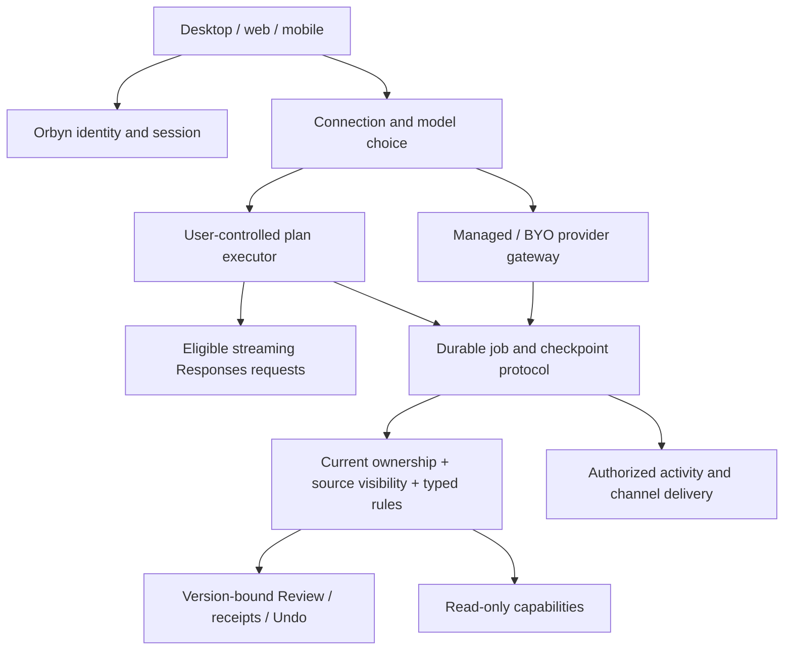

# DevDay 2026 → Orbyn: researched implementation proposal

**Status: REVIEW FIRST — no feature implementation authorized at this checkpoint.** Prepared 30 September 2026 against `main` at `b91ced2`. Worktree: `/Users/anhdang/.codex/worktrees/devday-2026-plan/Orbyn`; branch `codex/devday-2026-plan`. This document supersedes the implementation assumptions in `docs/openai-devday-2026.md`; the original is preserved beside it. Backend, desktop/web and mobile remain in scope.

## 1. What changed after research

| Original assumption                                              | Current evidence and consequence                                                                                                                                                                                                                                                                                                                                     |
| ---------------------------------------------------------------- | -------------------------------------------------------------------------------------------------------------------------------------------------------------------------------------------------------------------------------------------------------------------------------------------------------------------------------------------------------------------- |
| A1 treats ChatGPT identity and plan inference as one integration | They are distinct contracts. Website identity is a selected-partner trial; OSS plan usage has dynamic registration. Verify Orbyn's eligibility and deployment mode before promising website or mobile availability. [Quickstart](https://developers.openai.com/siwc/quickstart), [website](https://developers.openai.com/siwc/website).                              |
| Existing model adapter can be reused unchanged for plan usage    | Plan usage requires streaming Responses, `store:false`, a complete input array and restricted parameters/tools. Introduce a dedicated adapter and capability matrix. Existing server adapter returns a completed text response and is unsuitable unchanged. [Preview limitations](https://developers.openai.com/siwc/token-sharing-open-source/preview-limitations). |
| Model list is a generic normal API list with a curated fallback  | Documented plan catalog uses `models[]`, visibility, slug and display name. Refresh on account switch; never silently select an unentitled fallback. Preserve the user's model choice. [Models and inference](https://developers.openai.com/siwc/token-sharing-open-source/models-and-inference).                                                                    |
| Agent identity and rules are absent                              | Named assistant identity already lives in agent settings; standing rules already exist as text. New work is multi-agent ownership and deterministic enforcement, not a second unrelated identity system.                                                                                                                                                             |
| Document block tools are unlanded                                | That branch's work is already merged. Reuse current structured docs/comments and their revisions.                                                                                                                                                                                                                                                                    |
| Extensions have no docs, therefore A11 must wait                 | Public extension docs and SDK links exist. A11 can be scoped now, with host feature detection and a portable MCP fallback. [Extensions](https://developers.openai.com/plugins/build/extensions).                                                                                                                                                                     |
| Voice is only a keynote demo                                     | GPT-Live has public integration docs. A spike can use Orbyn's existing durable agent as the delegated backend. [GPT-Live](https://developers.openai.com/api/docs/guides/live).                                                                                                                                                                                       |
| Security CLI can simply run in CI                                | CLI availability does not imply scan entitlement: running scans needs Codex Security access. Keep CI secrets protected and patch publication human-approved. [Security access](https://developers.openai.com/blog/scaling-cyber-defenders-with-daybreak).                                                                                                            |
| Ultrafast is generically 6× priced                               | Do not carry this number into pricing UI. Sol documentation gives standard token rates and Fast at 2× standard; Fast and Ultrafast are distinct. Per-model/account availability must be checked. [Sol](https://developers.openai.com/api/docs/models/gpt-6.1-sol).                                                                                                   |

Dots, Space, Pro 500, Marketplace reach and Decisions preview details are not independently established by the developer pages fetched in this audit. Treat their product descriptions as inspiration, not an API contract or promised Orbyn dependency. No benchmark/price comparison is a measured Orbyn result.

## 2. Source and repository evidence

Official pages were opened, not merely search snippets. The source file's older checkout references are stale: R1–R10 and the Docker repair are now in main. This is source research and planning; no new product tests or provider calls were performed.

| Existing surface    | Inspected code                                                                                  | Reuse / remaining gap                                                                                                    |
| ------------------- | ----------------------------------------------------------------------------------------------- | ------------------------------------------------------------------------------------------------------------------------ |
| Provider adapters   | `backend/src/modules/ai/providers/adapters.ts`, `resolve.ts`                                    | Managed formats, Responses routing, timeout/error handling; add plan transport and explicit feature negotiation.         |
| Durable execution   | `backend/src/modules/ai/agent/run.ts`, `loop.ts`; `worker/night-shift.ts`                       | Leases, checkpoints, decisions and receipts; add device executor ownership without duplicating mutation engines.         |
| Identity and rules  | `modules/agent-context/routes.ts`; `packages/core/src/agent-inbox.ts`; `capabilities/policy.ts` | Named assistant and text rules already exist; typed rules and multiple agent records are new.                            |
| Activity / delivery | `modules/presence/live.ts`; `worker/delivery.ts`; `agent/notices.ts`                            | Existing announcements and durable notices; add resumable step events and external channel adapters.                     |
| Pages               | `modules/docs/comments.ts`, docs structure/services                                             | Human mentions and page authorization exist; scoped agent mentions/bound blocks require new behavior.                    |
| Distribution        | MCP catalog, `modules/mcp-server`, `modules/oauth`                                              | Existing OAuth server is not an SIWC identity client. Keep connector grants separate from OpenAI identity.               |
| CI                  | `.github/workflows/ci.yml`, `deploy.yml`                                                        | Tests, builds, mobile bundles and Docker checks exist. Security scanning/access and richer interactive QA are additions. |

## 3. Proposed architecture and invariants

**Credential boundary:** identity verification may create an Orbyn session. Plan access/refresh tokens stay in the authorized user-controlled runtime; server jobs hold an executor/connection reference, not those tokens. Device tool requests are untrusted instructions and must pass normal server capability authorization. A signed-in browser is not proof it may execute any job.

**Durability:** executor leases fence old devices; checkpoints and submission IDs survive reconnects; cancellation and approvals retain waiting identity checks. Refresh credentials atomically; switching account cannot reuse another account's model catalog or job. A fallback must use explicit consent and retain original provenance/billing visibility. No server-side account pooling.

**Permission composition:** effective access is the intersection of actor rights, workspace policy, agent scope, source visibility and rule restrictions. A page's grant list is an upper bound on eligible participants, not authority to impersonate another viewer. Never inherit the union of page viewers' permissions.

**Rules:** deterministic deny dominates approval, which dominates allow. Allow never overrides authentication, team policy, stale revisions, hard stops or source exclusion. Plain-language instructions remain guidance until converted into a reviewed typed rule. Rule edits invalidate applicable pending decisions and are rechecked before mutation.

## 4. Complete A1–A12 delivery ledger

Each row is part of the eventual scope. “Gate/spike” preserves the feature for review; it does not declare it delivered.

| ID / proposed priority         | Implementation deliverable and primary modules                                                                                                                                                                                                                                                                                                                           | Acceptance evidence required                                                                                                                                                                                                                                                                                   |
| ------------------------------ | ------------------------------------------------------------------------------------------------------------------------------------------------------------------------------------------------------------------------------------------------------------------------------------------------------------------------------------------------------------------------ | -------------------------------------------------------------------------------------------------------------------------------------------------------------------------------------------------------------------------------------------------------------------------------------------------------------- |
| A1 / P0: SIWC                  | Separate identity linking from plan credentials. Electron system-browser PKCE/state/nonce and validated ID token; secure OS storage; atomic refresh; first-option branding. Web partner flow and mobile callback/storage are separate eligibility spikes. Device executor, account model picker and dedicated SSE adapter in shared contracts + Electron/mobile modules. | State/nonce/replay/issuer/audience/account-link attacks rejected; no email-only account merge; actual eligible plan call; logout/revoke/account-switch tests; no tokens in server logs/DB; web and native callback proof. Unsupported deployment remains clearly unavailable, not a decorative sign-in button. |
| A2 / P0: managed AI            | Add connection-kind discriminator while keeping provider resolution, budgets, team/MCP flows and managed automations. Plan transport cannot leak into managed credentials or vice versa.                                                                                                                                                                                 | Existing provider suite passes; same managed conversation and automation behavior; explicit model/connection preserved; no silent paid fallback.                                                                                                                                                               |
| A3 / P0: Sol + caching         | Add catalog entry and capability validation; Responses tool path; supported reasoning values. Cache stable instruction/tool prefixes with documented controls, measure hits/write/input/output usage. Keep selected model rather than forcing a default.                                                                                                                 | Managed mock payload tests and real permitted probe; cost/latency quality evaluation against current baseline; unsupported settings fail clearly. API price is not an end-user plan bill.                                                                                                                      |
| A4 / P1: agent platform        | Typed per-action rules; adapt named assistant into multi-agent identity/owner/scope; link routines/goals, memory and channel settings; proactive read-only profile; persisted activity events; work/speed budgets; non-overridable hard stops; specialist agent ownership.                                                                                               | Every write path enforces rules; revocation during execution; impersonation/source leakage tests; job recovery with changed identity/scope; resumable activity; budget reservation races and accounting reconciliation; both clients render ownership/rules/activity.                                          |
| A5 / P2: maintained pages      | Bind exact block IDs to agent + schedule; preserve human blocks; `@orbyn` comments create scoped jobs and replies; page UI creates routines; authorization intersection; mobile reading/sharing and editing remain planned.                                                                                                                                              | Concurrent human edit produces conflict, not overwrite; deleted/moved blocks invalidate bindings; revoked page access stops work/delivery; mention edit/delete/retry dedup; private comments never enter shared results; desktop and mobile flows exercised.                                                   |
| A6 / P2: Slack then Teams      | OAuth installation, workspace/account mapping, opt-in DM delivery, durable outbox, signed callback validation, dedup, unsubscribe/revocation; replies map to exact waiting ID.                                                                                                                                                                                           | Provider mock contracts; verified signatures/replay/rate limits; real authorized test workspace delivery and stale reply rejection; titles rechecked for current visibility. Nothing sent without explicit connection consent.                                                                                 |
| A7 / P2: published pages       | Read-only publication record, explicit content selection, scoped revocable token, expiry and audit; distinguish pinned snapshot from live refresh. Reuse links/privacy modules.                                                                                                                                                                                          | Anonymous boundary tests; unpublished/private/source-excluded data absent; revocation immediate; updates don't silently broaden published scope; responsive viewer proof.                                                                                                                                      |
| A8 / P3: voice                 | GPT-Live client-delegated session around existing durable harness; short-lived session authorization, mic consent, audio interrupt/end, transcript choices, tool approval UI. Plan-route limitations require managed voice or a future eligible route.                                                                                                                   | Browser + native audio lifecycle; reconnect and interruption; approval remains visible and unconsumed; no duplicate writes; separate voice/backend cost reporting and retention policy.                                                                                                                        |
| A9 / P3: computer-use QA       | Internal isolated test runner using disposable accounts and builds; evaluate supported Responses/Agents API computer-use contract before selection; persist screenshots and replayable results. Product app-control remains a separate future permission decision.                                                                                                       | R1 recovery/stale-card/Undo scenarios on desktop and mobile; no production credentials or arbitrary destructive targets; failures produce actionable evidence.                                                                                                                                                 |
| A10 / P0 gate: security        | Confirm scan access, then scheduled CLI/SDK workflow with scoped secrets; threat models for OAuth, plan runtime, tools and publication; triage/dedup and reviewed patches.                                                                                                                                                                                               | Authorized scan artifact and controlled finding fixture; forks cannot read secrets; severity policy and human merge; report access unavailable accurately.                                                                                                                                                     |
| A11 / P2: plugin               | Build MCP Apps UI/extension resources, sidebar/composer/file-viewer entry points where supported; feature-detect hosts; preserve typed catalog and existing OAuth grants; partner SIWC outer/inner flows stay separate.                                                                                                                                                  | Local plugin connection, OAuth/account-switch, CSP/resource-origin and inaccessible-tool tests; supported ChatGPT/Codex surfaces proven; portable tool-only fallback. Submission approval is an external gate.                                                                                                 |
| A12 / research gate: Decisions | No verified public Decisions contract found. Define fixed-option classifier interface and baseline structured-output implementation; keep vendor adapter contingent on official schema, entitlement and pricing.                                                                                                                                                         | Validated enum output, bounded latency, confidence/abstain, no autonomous mutation; measured accuracy/cost baseline. Do not claim Decisions integration until it exists and is verified.                                                                                                                       |

Prompt caching controls are documented for newer models, including implicit versus explicit breakpoint choices; apply only to supporting managed routes and never assume a field is supported on plan usage. [Caching](https://developers.openai.com/api/docs/guides/prompt-caching).

## 5. Execution order and review gates

1. **Contract foundation:** SIWC eligibility/deployment decision, threat model, shared connection/executor types, provider capability matrix and clean Docker dependency checks. Desktop local spike first; backend/web/mobile design stays in scope.
2. **Provider and rules:** A2 regression baseline, A3 model/caching evaluation, A4 typed policy/hard stops, A10 scan-access check. Auth “first option” becomes enabled only for platforms where the correct flow is available.
3. **Local plan runtime:** A1 credential flow and real inference, then executor fencing/reconnect/consent/fallback. Approval/mutations stay on Orbyn's existing authorized receipt path. Mobile rollout waits for native flow feasibility, not an invented loopback equivalent.
4. **Agent ownership:** A4 identities, routines/goals, scope, events and budgets; migrate existing named assistant without losing memory or schedules.
5. **Collaboration/distribution:** A5 bound pages/comments, A6 channels, A7 publication and A11 plugin. Deliver end-to-end permission and cross-client proof per feature.
6. **Voice/QA/research:** A8 and A9 controlled spikes; A12 baseline and official-contract follow-up. Promote each through explicit acceptance gates.

No calendar estimate is committed: partner access, native callback constraints and external integrations are not established. Each stage needs backend focused regressions, full suite, core/API/client typechecks, clean backend/web images, migrations from empty and previous schema, iOS/Android exports, desktop/web and native mobile interaction proof. Existing 1,726-test results establish the prior baseline only.

## 6. Decisions for review

Preserve the source file's stated preferences: SIWC first when eligible, managed API available, user selects the model. The following are proposals requiring review:

- Launch plan runtime on personal desktop first; do not enable shared-team plan billing until ownership/terms are reviewed.
- Offline plan jobs defer by default; managed fallback requires explicit per-user authorization, clear billing and a recorded connection change.
- Multi-agent scope and typed rules precede assistant-maintained shared pages.
- Keep current MCP `get_profile` design; the obsolete Memory draft's profile relocation is not a prerequisite for SIWC.
- Web SIWC partner access and mobile flow feasibility are release gates. Continue existing sign-in while unavailable.
- Live published pages require explicit live consent, not an automatic widening of a snapshot link.
- Security scan entitlement, Slack/Teams credentials and real plan/voice tests require the user's authorized test accounts at implementation time.

## 7. Cleanup and stop boundary

All old refs are recoverable in `.codex-cleanup-backups/2026-09-30/all-refs-before-final-cleanup.bundle` in the primary checkout. Local worktree configuration and untracked Gradle files were preserved before old worktree removal. The original branch review is retained as historical evidence.

Remote cleanup status: automatic approval review rejected deletion of all 49 non-main GitHub branches; exact-scope confirmation is pending. The new planning branch is local only.

**Stop after review delivery.** This artifact is a proposed implementation contract, not a completion claim. No application source changes, deployment, account linking, provider requests, external messages or CI scan setup are included in this planning checkpoint.
