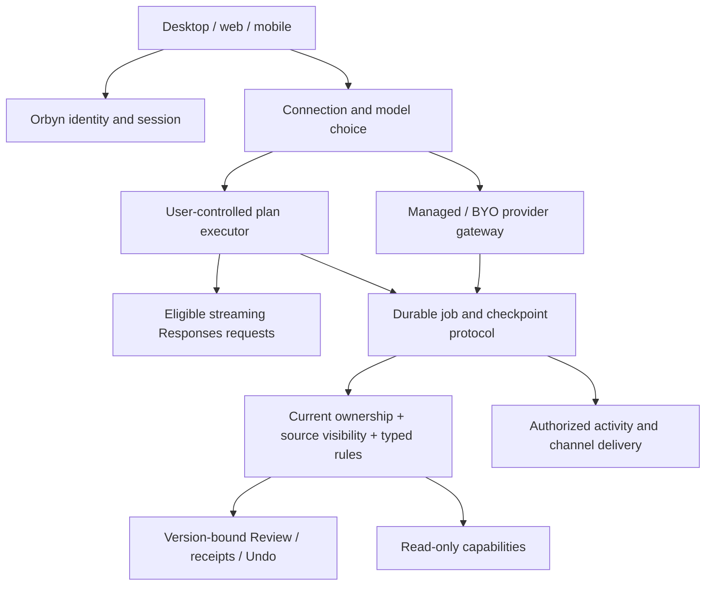

# DevDay 2026 → Orbyn: researched implementation proposal

**Status: revised implementation contract; user authorized tested production checkpoints.** Prepared 30 September 2026 against `main` at `b91ced2`. Worktree: `/Users/anhdang/.codex/worktrees/devday-2026-plan/Orbyn`; branch `codex/devday-2026-plan`. This document supersedes the implementation assumptions in `docs/openai-devday-2026.md`; the original is preserved beside it. Backend, desktop/web and mobile remain in scope.

## 1. What changed after research

| Original assumption                                              | Current evidence and consequence                                                                                                                                                                                                                                                                                                                                     |
| ---------------------------------------------------------------- | -------------------------------------------------------------------------------------------------------------------------------------------------------------------------------------------------------------------------------------------------------------------------------------------------------------------------------------------------------------------- |
| A1 treats ChatGPT identity and plan inference as one integration | They are distinct contracts. Website identity is a selected-partner trial; OSS plan usage has dynamic registration. Verify Orbyn's eligibility and deployment mode before promising website or mobile availability. [Quickstart](https://developers.openai.com/siwc/quickstart), [website](https://developers.openai.com/siwc/website).                              |
| Existing model adapter can be reused unchanged for plan usage    | Plan usage requires streaming Responses, `store:false`, a complete input array and restricted parameters/tools. Introduce a dedicated adapter and capability matrix. Existing server adapter returns a completed text response and is unsuitable unchanged. [Preview limitations](https://developers.openai.com/siwc/token-sharing-open-source/preview-limitations). |
| Model list is a generic normal API list with a curated fallback  | Documented plan catalog uses `models[]`, visibility, slug and display name. Refresh on account switch; never silently select an unentitled fallback. Preserve the user's model choice. [Models and inference](https://developers.openai.com/siwc/token-sharing-open-source/models-and-inference).                                                                    |
| Agent identity and rules are absent                              | Named assistant identity already lives in agent settings; standing rules already exist as text. New work is multi-agent ownership and deterministic enforcement, not a second unrelated identity system.                                                                                                                                                             |
| Document block tools are unlanded                                | That branch's work is already merged. Reuse current structured docs/comments and their revisions.                                                                                                                                                                                                                                                                    |
| Extensions have no docs, therefore A11 must wait                 | Public extension docs and SDK links exist. A11 can be scoped now, with host feature detection and a portable MCP fallback. [Extensions](https://developers.openai.com/plugins/build/extensions).                                                                                                                                                                     |
| Security CLI can simply run in CI                                | CLI availability does not imply scan entitlement: running scans needs Codex Security access. Keep CI secrets protected and patch publication human-approved. [Security access](https://developers.openai.com/blog/scaling-cyber-defenders-with-daybreak).                                                                                                            |
| Ultrafast is generically 6× priced                               | Do not carry this number into pricing UI. Sol documentation gives standard token rates and Fast at 2× standard; Fast and Ultrafast are distinct. Per-model/account availability must be checked. [Sol](https://developers.openai.com/api/docs/models/gpt-6.1-sol).                                                                                                   |

Dots, Space, Pro 500, Marketplace reach and Decisions preview details are not independently established by the developer pages fetched in this audit. Treat their product descriptions as inspiration, not an API contract or promised Orbyn dependency. No benchmark/price comparison is a measured Orbyn result.

## 2. Source and repository evidence

Official pages were opened, not merely search snippets. The source file's older checkout references are stale: R1–R10 and the Docker repair are now in main. This is source research and planning; no new product tests or provider calls were performed.

| Existing surface    | Inspected code                                                                                  | Reuse / remaining gap                                                                                                    |
| ------------------- | ----------------------------------------------------------------------------------------------- | ------------------------------------------------------------------------------------------------------------------------ |
| Provider adapters   | `backend/src/modules/ai/providers/adapters.ts`, `resolve.ts`                                    | Managed formats, Responses routing, timeout/error handling; add plan transport and explicit feature negotiation.         |
| Durable execution   | `backend/src/modules/ai/agent/run.ts`, `loop.ts`; `worker/night-shift.ts`                       | Leases, checkpoints, decisions and receipts; add device executor ownership without duplicating mutation engines.         |
| Identity and rules  | `modules/agent-context/routes.ts`; `packages/core/src/agent-inbox.ts`; `capabilities/policy.ts` | Named assistant and text rules already exist; typed rules and multiple agent records are new.                            |
| Activity / delivery | `modules/presence/live.ts`; `worker/delivery.ts`; `agent/notices.ts`                            | Existing announcements and durable notices; add resumable step events and external channel adapters.                     |
| Pages               | `modules/docs/comments.ts`, docs structure/services                                             | Human mentions and page authorization exist; scoped agent mentions/bound blocks require new behavior.                    |
| Distribution        | MCP catalog, `modules/mcp-server`, `modules/oauth`                                              | Existing OAuth server is not an SIWC identity client. Keep connector grants separate from OpenAI identity.               |
| CI                  | `.github/workflows/ci.yml`, `deploy.yml`                                                        | Tests, builds, mobile bundles and Docker checks exist. Security scanning/access and richer interactive QA are additions. |

## 3. Proposed architecture and invariants

**Credential boundary:** identity verification may create an Orbyn session. Plan access/refresh tokens stay in the authorized user-controlled runtime; server jobs hold an executor/connection reference, not those tokens. Device tool requests are untrusted instructions and must pass normal server capability authorization. A signed-in browser is not proof it may execute any job.

**Durability:** executor leases fence old devices; checkpoints and submission IDs survive reconnects; cancellation and approvals retain waiting identity checks. Refresh credentials atomically; switching account cannot reuse another account's model catalog or job. A fallback must use explicit consent and retain original provenance/billing visibility. No server-side account pooling.

**Permission composition:** effective access is the intersection of actor rights, workspace policy, agent scope, source visibility and rule restrictions. A page's grant list is an upper bound on eligible participants, not authority to impersonate another viewer. Never inherit the union of page viewers' permissions.

**Rules:** deterministic deny dominates approval, which dominates allow. Allow never overrides authentication, team policy, stale revisions, hard stops or source exclusion. Plain-language instructions remain guidance until converted into a reviewed typed rule. Rule edits invalidate applicable pending decisions and are rechecked before mutation.

## 4. Delivery ledger for the retained scope

Each row is part of the eventual scope. “Gate/spike” preserves the feature for review; it does not declare it delivered.

| ID / proposed priority    | Implementation deliverable and primary modules                                                                                                                                                                                                                                                                                                                           | Acceptance evidence required                                                                                                                                                                                                                                                                                   |
| ------------------------- | ------------------------------------------------------------------------------------------------------------------------------------------------------------------------------------------------------------------------------------------------------------------------------------------------------------------------------------------------------------------------ | -------------------------------------------------------------------------------------------------------------------------------------------------------------------------------------------------------------------------------------------------------------------------------------------------------------- |
| A1 / P0: SIWC             | Separate identity linking from plan credentials. Electron system-browser PKCE/state/nonce and validated ID token; secure OS storage; atomic refresh; first-option branding. Web partner flow and mobile callback/storage are separate eligibility spikes. Device executor, account model picker and dedicated SSE adapter in shared contracts + Electron/mobile modules. | State/nonce/replay/issuer/audience/account-link attacks rejected; no email-only account merge; actual eligible plan call; logout/revoke/account-switch tests; no tokens in server logs/DB; web and native callback proof. Unsupported deployment remains clearly unavailable, not a decorative sign-in button. |
| A2 / P0: managed AI       | Add connection-kind discriminator while keeping provider resolution, budgets, team/MCP flows and managed automations. Plan transport cannot leak into managed credentials or vice versa.                                                                                                                                                                                 | Existing provider suite passes; same managed conversation and automation behavior; explicit model/connection preserved; no silent paid fallback.                                                                                                                                                               |
| A3 / P0: Sol + caching    | Add catalog entry and capability validation; Responses tool path; supported reasoning values. Cache stable instruction/tool prefixes with documented controls, measure hits/write/input/output usage. Keep selected model rather than forcing a default.                                                                                                                 | Managed mock payload tests and real permitted probe; cost/latency quality evaluation against current baseline; unsupported settings fail clearly. API price is not an end-user plan bill.                                                                                                                      |
| A4 / P1: agent platform   | Typed per-action rules; adapt named assistant into multi-agent identity/owner/scope; link routines/goals, memory and channel settings; proactive read-only profile; persisted activity events; work/speed budgets; non-overridable hard stops; specialist agent ownership.                                                                                               | Every write path enforces rules; revocation during execution; impersonation/source leakage tests; job recovery with changed identity/scope; resumable activity; budget reservation races and accounting reconciliation; both clients render ownership/rules/activity.                                          |
| A5 / P2: maintained pages | Bind exact block IDs to agent + schedule; preserve human blocks; `@orbyn` comments create scoped jobs and replies; page UI creates routines; authorization intersection; mobile reading/sharing and editing remain planned.                                                                                                                                              | Concurrent human edit produces conflict, not overwrite; deleted/moved blocks invalidate bindings; revoked page access stops work/delivery; mention edit/delete/retry dedup; private comments never enter shared results; desktop and mobile flows exercised.                                                   |
| A6 / P2: Slack then Teams | OAuth installation, workspace/account mapping, opt-in DM delivery, durable outbox, signed callback validation, dedup, unsubscribe/revocation; replies map to exact waiting ID.                                                                                                                                                                                           | Provider mock contracts; verified signatures/replay/rate limits; real authorized test workspace delivery and stale reply rejection; titles rechecked for current visibility. Nothing sent without explicit connection consent.                                                                                 |
| A7 / P2: published pages  | Read-only publication record, explicit content selection, scoped revocable token, expiry and audit; distinguish pinned snapshot from live refresh. Reuse links/privacy modules.                                                                                                                                                                                          | Anonymous boundary tests; unpublished/private/source-excluded data absent; revocation immediate; updates don't silently broaden published scope; responsive viewer proof.                                                                                                                                      |
| A10 / P0 gate: security   | Confirm scan access, then scheduled CLI/SDK workflow with scoped secrets; threat models for OAuth, plan runtime, tools and publication; triage/dedup and reviewed patches.                                                                                                                                                                                               | Authorized scan artifact and controlled finding fixture; forks cannot read secrets; severity policy and human merge; report access unavailable accurately.                                                                                                                                                     |
| A11 / P2: plugin          | Build MCP Apps UI/extension resources, sidebar/composer/file-viewer entry points where supported; feature-detect hosts; preserve typed catalog and existing OAuth grants; partner SIWC outer/inner flows stay separate.                                                                                                                                                  | Local plugin connection, OAuth/account-switch, CSP/resource-origin and inaccessible-tool tests; supported ChatGPT/Codex surfaces proven; portable tool-only fallback. Submission approval is an external gate.                                                                                                 |

Prompt caching controls are documented for newer models, including implicit versus explicit breakpoint choices; apply only to supporting managed routes and never assume a field is supported on plan usage. [Caching](https://developers.openai.com/api/docs/guides/prompt-caching).

## 5. Execution order and review gates

1. **Contract foundation:** SIWC eligibility/deployment decision, threat model, shared connection/executor types, provider capability matrix and clean Docker dependency checks. Desktop local spike first; backend/web/mobile design stays in scope.
2. **Provider and rules:** A2 regression baseline, A3 model/caching evaluation, A4 typed policy/hard stops, A10 scan-access check. Auth “first option” becomes enabled only for platforms where the correct flow is available.
3. **Local plan runtime:** A1 credential flow and real inference, then executor fencing/reconnect/consent/fallback. Approval/mutations stay on Orbyn's existing authorized receipt path. Mobile rollout waits for native flow feasibility, not an invented loopback equivalent.
4. **Agent ownership:** A4 identities, routines/goals, scope, events and budgets; migrate existing named assistant without losing memory or schedules.
5. **Collaboration/distribution:** A5 bound pages/comments, A6 channels, A7 publication and A11 plugin. Deliver end-to-end permission and cross-client proof per feature.
6. **Docs and UI parity:** deliver the D1 Markdown contract and U1 cross-client regression matrix below. Voice, computer-use features/harnesses and the speculative Decisions adapter are removed from delivery scope.

No calendar estimate is committed: partner access, native callback constraints and external integrations are not established. Each stage needs backend focused regressions, full suite, core/API/client typechecks, clean backend/web images, migrations from empty and previous schema, iOS/Android exports, desktop/web and native mobile interaction proof. Existing 1,726-test results establish the prior baseline only.

## 6. Decisions for review

Preserve the source file's stated preferences: SIWC first when eligible, managed API available, user selects the model. The following are proposals requiring review:

- Launch plan runtime on personal desktop first; do not enable shared-team plan billing until ownership/terms are reviewed.
- Offline plan jobs defer by default; managed fallback requires explicit per-user authorization, clear billing and a recorded connection change.
- Multi-agent scope and typed rules precede assistant-maintained shared pages.
- Keep current MCP `get_profile` design; the obsolete Memory draft's profile relocation is not a prerequisite for SIWC.
- Web SIWC partner access and mobile flow feasibility are release gates. Continue existing sign-in while unavailable.
- Live published pages require explicit live consent, not an automatic widening of a snapshot link.
- Security scan entitlement, Slack/Teams credentials and real plan inference tests require authorized test accounts at implementation time.

## 7. Cleanup and stop boundary

All old refs are recoverable in `.codex-cleanup-backups/2026-09-30/all-refs-before-final-cleanup.bundle` in the primary checkout. Local worktree configuration and untracked Gradle files were preserved before old worktree removal. The original branch review is retained as historical evidence.

Remote cleanup status: automatic approval review rejected deletion of all 49 non-main GitHub branches; exact-scope confirmation is pending. The new planning branch is local only.

**Implementation proceeds in checkpoints after this revision.** Each merge requires the acceptance evidence below. Architecture documentation does not constitute delivered product behavior.

## 8. Revised scope and added contracts

The user removed voice and computer use. A8, A9 and speculative A12 are not implementation deliverables. Their historical research in the original source file is superseded by this contract. Security scanning remains an access-gated engineering control, not an autonomous app-control feature.

### P1 — Separate plugin backend integration

Add a plugin integration module and explicit service boundary alongside the existing MCP process. Plugin resource/UI/event handlers use the same typed capabilities but an independently authenticated connector principal; they do not call the browser's assistant session or impersonate first-party routes. Host-provided metadata is untrusted. Plugin backend provider calls use authorized managed/BYO connections only. User-controlled plan tokens never enter this integration. Apply trust, scopes, revisions and durable receipts before writes. Share domain services rather than duplicating tool mutations. Define explicit schemas for launch context, UI resource reads, tool calls, asynchronous job/result events and reconnect cursors. Retain the existing portable MCP surface. Test separate issuer/resource/audience and account-switch behavior, inaccessible tools, rate limiting, duplicate callbacks and tenant isolation.

### M1 — Account model catalog and defaults

Expose a first-party `/models` experience for ChatGPT-connected users. The credential-owning runtime fetches `GET https://api.openai.com/v1/models` with that account's token, normalizes `models[]` using list visibility, slug and display name, and preserves upstream ordering. Backend GET `/models` requires an Orbyn session and returns only sanitized catalog metadata for the selected user-owned connection/executor; it never proxies arbitrary URLs or accepts a plan token. A device publishes an account-bound catalog snapshot through its authenticated executor channel. A missing/offline/expired snapshot is explicitly unavailable/stale, not a managed catalog mislabeled as ChatGPT. Persist default model by user + connection + ChatGPT account/workspace. Changing the account refreshes its catalog and restores that account's default. An unavailable saved model is shown as unavailable and requires a new choice; never silently replace it. Inference rechecks current model availability in the credential-owning runtime. Plugin calls cannot access this first-party preference API. Settings and composer share one selected/default state; model and connection switch cancel old loads. Tests include cross-user snapshots, invalid defaults, stale/offline catalog, account switching, revocation, reconnect and concurrent preference edits. [Official catalog contract](https://developers.openai.com/siwc/token-sharing-open-source/models-and-inference).

### D1 — Markdown visualization parity

Use the VS Code built-in Markdown experience as a concrete baseline, with documented extensions rather than unlimited third-party extension execution. Keep Orbyn's structured blocks and canonical Markdown representation.

| Capability     | Required behavior and verification                                                                                                                                                                                                                                              |
| -------------- | ------------------------------------------------------------------------------------------------------------------------------------------------------------------------------------------------------------------------------------------------------------------------------- |
| CommonMark/GFM | Headings and anchors, paragraphs, hard/soft breaks, emphasis/strike, quotes, nested ordered/unordered/task lists, rules, escaped text, tables, links and images; import/edit/export round-trip fixtures, including embedded fences.                                             |
| Code           | Language-aware bundled syntax coloring, copy/source view, long-line scrolling contained within block, accessible fallback for unknown languages; no execution.                                                                                                                  |
| Mermaid        | Desktop and mobile flowchart, sequence, state, class, ER, gantt, pie, journey, mindmap and timeline fixtures; strict configuration, diagrams cannot override security or execute links/scripts; useful parse error + editable source; zoom/scroll/export without page overflow. |
| Math           | Inline/display LaTeX rendering, accessible source, consistent preview and export; malformed expressions do not break the page.                                                                                                                                                  |
| Extended text  | Existing callouts, highlights and footnotes; reference links, YAML frontmatter preservation and TOC/heading navigation. Raw HTML never executes; unsupported syntax is retained as source rather than discarded.                                                                |
| Preview        | Source and rendered view, desktop side-by-side with block/line mapping and scroll synchronization; mobile toggle in the same document; revisions/save status shared rather than competing drafts.                                                                               |
| Export/share   | Markdown source preserved; rendered HTML/PDF contain diagrams/math when supported; snapshot/publication respects authorization and current sources; no private resource links disclosed.                                                                                        |
| Media/security | Current file-store authorization, alt text and safe URL protocols; no remote scripts, iframe execution or diagram-driven external calls; malformed/huge diagrams bounded.                                                                                                       |

Existing desktop Mermaid and rich blocks are reused. Mobile's current flowchart-only renderer is insufficient for D1. Choose a bundled isolated rendering surface or authorized generated SVG with sanitized bounded output; validate Expo/native support before selecting the implementation. No renderer choice may turn private diagrams into publicly accessible assets. [VS Code baseline](https://code.visualstudio.com/docs/languages/markdown), [Mermaid security](https://mermaid.js.org/config/schema-docs/config-properties-securitylevel.html).

### U1 — UI synchronization and regression gate

Audit all affected current surfaces: Assistant/Overnight/reminder cards, Docs/editor/comment layers, settings/auth/model picker, navigation/deep links, plugin UI and public viewers. Test narrow phones, tablet widths and wide desktop, both themes, keyboard open/closed, large text, long labels/code/tables/diagrams, empty/error/loading states and overlay nesting. Menus/modals must remain within the viewport and have one focus owner. Restore/send/poll generations, live events, dirty editor saves, model switching and stale approvals must not overwrite newer state. Cover native iOS and Android interactions separately from mobile web. Typechecks/exports alone do not prove touch or visual behavior. Keep visual proof and feature-by-feature acceptance status in the ledger. Do not claim all prior UI defects are fixed without inspecting and reproducing their affected surfaces.

### Checkpoint policy

C0: this ADR/artifact revision (documentation only). C1: model/provider/connection contracts. C2: SIWC/catalog/defaults and device execution. C3: typed rules/agent ownership/activity/budgets. C4: Docs parity and UI regressions. C5: bound pages/publication/channels. C6: separate plugin backend/UI and access-gated security controls. Dependencies can change order, but every retained ledger row must finish. Each production checkpoint receives a scoped commit, main integration, current test/build/runtime evidence and explicit external-access limitations. Preserve user changes in the primary checkout.
