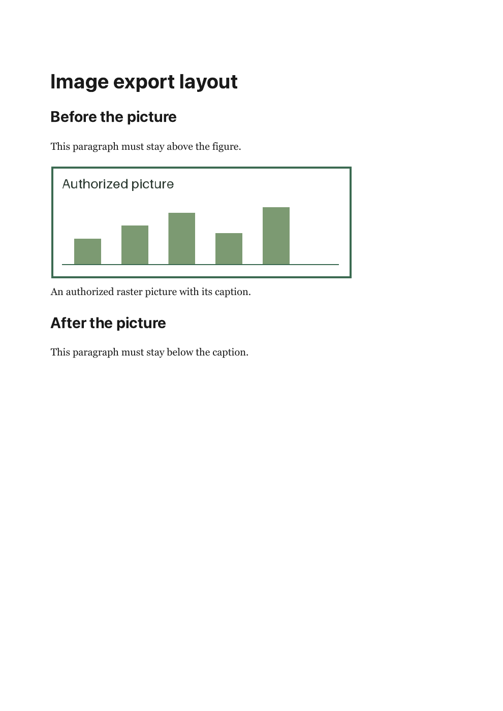

# Authorized picture export evidence — 3 October 2026

Candidate: `codex/docs-export-images`, based on qualified maine06c4484. The existing
shared export endpoint embeds current authorized raster pictures into PDF and HTML.
Word/Markdown/text picture representations are unchanged; their complete rich
export parity remains an open D1 gate.

## Implementation

- Primary file access/readiness query uses the existing permission predicate.
  Unique PNG/JPEG/GIF/WebP images are fetched sequentially from signed first-party
  file paths. No authored URLs, redirects or file credentials enter the renderer.
- Limits:32 unique images,4MiB each,8MiB total and15s combined fetch deadline.
  Exact declared/received byte lengths, MIME and raster signatures must agree.
  Final HTML is limited to20MiB. Decoder resource bounds remain those of the
  private sandboxed renderer; signature checks are not a full image decoder.
- PDF/HTML delivery rechecks page revision/visibility and included file access.
  Missing/revoked images fail404; metadata changes409; oversized input413;
  invalid/unavailable bytes503. There is no silent caption-only partial file.
- Disconnect cancels loading; handler lifecycle listeners are removed in finally.
  Signed reads expire after30s. Signed file capability paths and their query tails are redacted in service
  request logs. The loader never logs keys, tokens or image bytes.
- Copied images remain readable/exportable after the original page is gone:
  stored-ready bytes require a valid signed claim, not an unnecessary non-null
  original-page ID. The issuing API still checks owner/live-reference access.

## Current evidence

- 38 loader/actual-route/logger units pass, including real HTTP redirect refusal,
  stalled-stream cancellation, count/individual/aggregate limits, MIME/signature
  mismatch, duplicate references and post-render access/revision fences and actual Fastify capability-URL redaction.
- 42 actual API export/rich-page checks pass with the real encrypted file store
  exposed on the test process's own HTTP listener and the real private PDF service.
  Includes foreign/missing images, deletion during rendering, retained copies,
  image bytes in standalone HTML and raster objects in the PDF.

- Larger640×240 uploaded-image fixture prints on one page with authored75% width,
  caption and surrounding headings. Screenshot inspected at1400px: no clipping
  or overlap. Artifact `/tmp/orbyn-export-images-qa.pdf`.

Logs: `/tmp/orbyn-export-images-qualified-units.log` and
`/tmp/orbyn-export-images-wired-api-final.log`. All workspace typechecks, production builds and full formatting pass. Logs:
`/tmp/orbyn-export-images-qualified-{types,build,format}.log`. Full exact-head
local and CI qualification are still required before main promotion. Native download/share interaction,
rendered HTML diagrams, publication and the remaining full ADR are incomplete.
No user app UI permission was bypassed; this screenshot is a synthetic exported
PDF, not web/native application acceptance. No deployment/release/cleanup.
