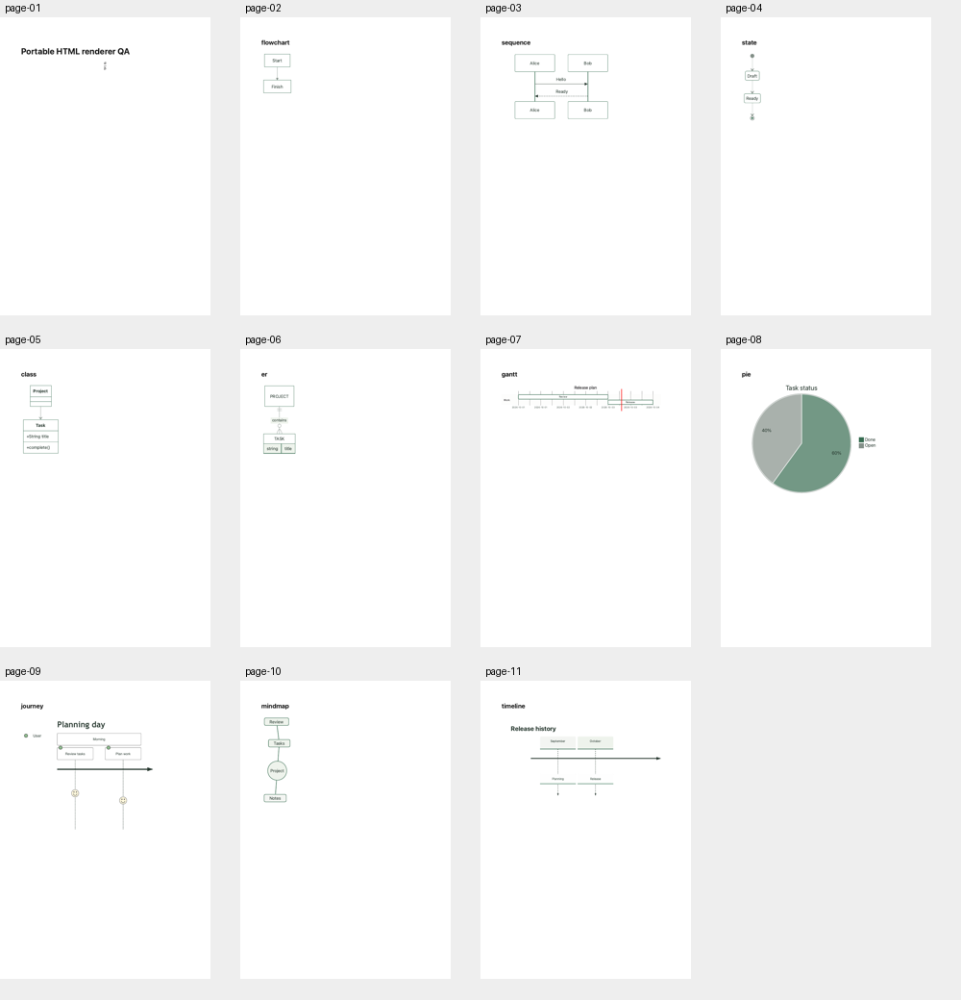

# Portable rendered HTML candidate — 3 October 2026

Branch `codex/docs-rendered-html`, reconciled with main192cb475 after image PR162 merged. Image head30b496aa passed2,269/2,269 full local tests and all four exact CI37064382202 jobs.
The existing HTML export endpoint now renders diagrams through the same private,
first-party isolated engine as PDF rather than leaving only source markers.

## Invariants

- Separate `/render/html` signatures use the HTML domain. A PDF signature cannot
  authorize HTML output or the reverse. Both formats share the same nonce cache,
  authentication-before-parsing, concurrency/byte/deadline limits and cleanup.
- Renderer outputs script-free self-contained HTML with inert bounded SVG data
  URIs, MathML and retained escaped diagram source. CSP is inserted before the
  content; scripts, frames and external resource loads remain denied. The engine
  remains in a separate private page/process profile, never a user browser.
- Portable HTML includes a responsive viewport, narrow-screen text wrapping and horizontally scrollable tables, and keeps screen styling; print overrides live under `@media print`.
  Images/fonts must load before handoff. Cancellation, failure or oversized output
  cannot return a partial file. The API rechecks current page/file authority.
- Existing DOC_PDF configuration/private image serves both formats. No additional
  credentials, network permissions, browser UI access or provider fallbacks.

## Current evidence

- 48 renderer/service/client/actual-route units pass. New coverage includes output
  format signature separation, query-string auth, shared no-queue concurrency,
  HTML replay refusal, inert SVG/retained-source/fallback behavior and cancellation.
- 43 actual export/rich-page API checks pass, including all ten HTML diagram
  families, required SVG labels, math, inert source containing a script tag,
  raster image bytes and current permission/revision checks. Real encrypted file
  store and sandboxed Chromium service exercised.
- All workspace typechecks, production builds and full formatting pass.
- Actual downloaded HTML `/tmp/orbyn-rendered-html-qa.html` printed offline as
  `/tmp/orbyn-rendered-html-proof.pdf` (277284bytes). Eleven-page contact inspected;
  Gantt/journey/timeline pages also inspected individually at1000px. No clipping
  or overlap in these fixtures. Deliberate per-family page breaks were added only
  to the print QA copy. Gantt's repeated date labels from sub-day ticks remain a
  shared presentation refinement; this is not a claim of complete Mermaid UX.

Logs: `/tmp/orbyn-html-renderer-final-units.log`,
`/tmp/orbyn-html-renderer-final-api.log`, and
`/tmp/orbyn-html-renderer-current-{all-types,build,format}.log`.
Initial implementation checks caught a missing auth format variable and a test
fixture missing the authorized diagram class; corrected and rerun. A test-file
editing mistake was restored from the parent before adding the two format tests;
existing service regression coverage remains present. Initial API marker-only
expectation was strengthened to require an actual inert SVG and retained source.

The first full qualification at `82a06733` failed: local 2,276/2,277
and CI37066687318 both found the same legacy link-privacy HTML export test
missing its private renderer fixture. The fixture now starts and closes its own
actual service before application configuration is imported; all 18 privacy
checks pass, with private-title assertions retained. The failed head is not
qualified. Full qualification of the repaired head is required before promotion;
parent image qualification is complete. Publication/reference/source/editor parity, native sharing and
broader C1–C6/M1/D1/U1 remain open. No app UI permission was bypassed; PDF evidence
is a synthetic export check, not web/native visual acceptance. No deploy/release/
cleanup and no voice/computer-use product expansion.
